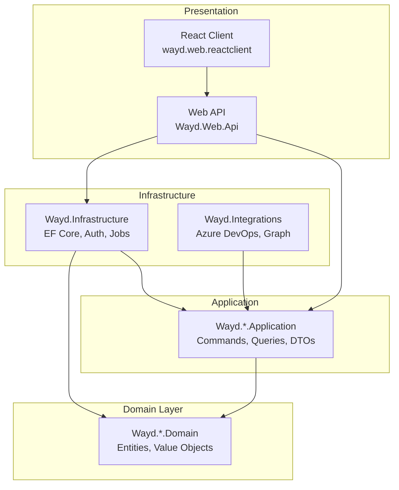

# Architecture

Wayd follows **Clean Architecture** with **Domain-Driven Design (DDD)** principles, organized as a **modular monolith** with a shared database.

## Clean Architecture Layers



### Dependency Rules

- **Domain** (innermost) - Zero external dependencies. Contains entities, value objects, domain events, and interfaces.
- **Application** - Depends on Domain only. Contains commands, queries, handlers, DTOs, and validators.
- **Infrastructure** - Depends on Application and Domain. Contains EF Core, authentication, background jobs, and external integrations.
- **Web API** - Depends on all layers. Thin controllers that delegate to MediatR handlers.

These rules are enforced by automated architecture tests in `Wayd.ArchitectureTests`.

## Solution Structure

```
Wayd/
  Wayd.Common/           # Shared libraries and base abstractions
    Wayd.Common          # Utilities, extensions, helpers
    Wayd.Common.Domain   # Base entities, value objects, interfaces
    Wayd.Common.Application  # Base behaviors, validators, interfaces
    Wayd.Tests.Shared    # Shared test utilities and fakers

  Wayd.Services/         # Vertical slice domain services
    Wayd.Work/           # Work item management
    Wayd.Organization/   # Teams and employees
    Wayd.Planning/       # Iterations and planning intervals
    Wayd.Goals/          # Objectives and key results
    Wayd.AppIntegration/ # Integration configuration
    Wayd.Links/          # Cross-entity relationships
    Wayd.StrategicManagement/   # Strategic planning
    Wayd.ProjectPortfolioManagement/  # Project portfolios

  Wayd.Infrastructure/   # Cross-cutting concerns
  Wayd.Integrations/     # External system integrations
  Wayd.Web/              # Presentation layer
```

## Key Patterns

### CQRS with MediatR

All business operations are modeled as commands (writes) or queries (reads), dispatched through MediatR. Controllers are thin and contain no business logic.

```csharp
// Command
public sealed record CreateWorkItemCommand(string Title, Guid WorkspaceId) : ICommand<Guid>;

// Query
public sealed record GetWorkItemQuery(Guid Id) : IQuery<WorkItemDto>;
```

### Result Pattern

Handlers return `Result&lt;T&gt;` from CSharpFunctionalExtensions instead of throwing exceptions:

```csharp
public async Task<Result<Guid>> Handle(CreateWorkItemCommand request, CancellationToken ct)
{
    var workspace = await _context.Workspaces.FindAsync(request.WorkspaceId);
    if (workspace is null)
        return Result.Failure<Guid>("Workspace not found.");

    var workItem = workspace.CreateWorkItem(request.Title);
    return Result.Success(workItem.Id);
}
```

### No Repository Pattern

Application handlers use EF Core `DbContext` directly for data access. There is no repository abstraction layer.

### Vertical Slices

Each service follows consistent Domain/Application layering:

```
Wayd.Services/Wayd.\{ServiceName\}/
  src/
    Wayd.\{ServiceName\}.Domain/        # Entities, value objects, interfaces
    Wayd.\{ServiceName\}.Application/   # Commands, queries, DTOs, validators
  tests/
    Wayd.\{ServiceName\}.Domain.Tests/
    Wayd.\{ServiceName\}.Application.Tests/
```

### Feature Folders

Application layer is organized by aggregate root/feature:

```
Wayd.Work.Application/
  WorkItems/
    Commands/
      CreateWorkItemCommand.cs
      CreateWorkItemCommandValidator.cs
    Queries/
      GetWorkItemQuery.cs
    Dtos/
      WorkItemDto.cs
```

## Connector framework

Customer-configured integrations (Azure DevOps, Azure OpenAI, future Jira / GitHub / HR connectors) plug into a shared framework in the `Wayd.AppIntegration` service, the `Wayd.Integrations.*` projects, and a frontend registry pair. The goal is that adding a connector is *additive* — drop in new files, register them, no edits to the generic plumbing.

### Backend shape

| Concern | Lives in | Pattern |
|---|---|---|
| Aggregate | `Wayd.AppIntegration.Domain/Models/` | `Connection<TConfiguration>` base; subclass per connector. Implement `ISyncableConnection` if the connector pulls data. |
| Configuration | `Wayd.AppIntegration.Domain/Models/.../*ConnectionConfiguration.cs` | Plain POCO stored as JSON. Mark credential fields with `[Encrypted]` (from `Wayd.Common.Domain.DataProtection`) so they're encrypted at rest by `EncryptingJsonValueConverter`. |
| Commands / Queries | `Wayd.AppIntegration.Application/Connections/Commands/\{Connector\}/`, `.../Queries/` | One folder per connector. CQRS via MediatR, validators via FluentValidation. |
| Polymorphic DTO | `Wayd.AppIntegration.Application/Connections/Dtos/ConnectionDetailsDto.cs` | Add a `[JsonDerivedType]` entry; controllers switch on the request/DTO type to dispatch to the right handler. |
| External client | `Wayd.Integrations.\{SystemName\}/` | Only if the connector actually talks to a remote API. Pure AI providers can wrap an existing SDK directly inside the application layer. |
| Persistence | `Wayd.Infrastructure/Persistence/Configuration/AppIntegrationConfiguration.cs` | TPH discriminator; one entity-config per concrete connection class. Use `HasEncryptedJsonConversion()` for the configuration column. |
| Sync orchestration (work-sync connectors only) | `Wayd.Integrations.Abstractions/IWorkItemSource.cs` + `Wayd.AppIntegration.Application/Connections/Managers/\{Connector\}WorkItemSource.cs` | Implement `IWorkItemSource` for the connector. Register it keyed by `Connector` enum value (`AddKeyedTransient<IWorkItemSource, MySource>(Connector.X)`). The generic `WorkSyncRunner` calls every registered source on a single Hangfire schedule — no per-connector job. |

### Sync orchestration

Work-sync connectors (AzDO today, Jira/GitHub in future) plug into a single generic runner. The pieces:

- **`IWorkItemSource`** ([Wayd.Integrations.Abstractions](https://github.com/destacey/Wayd/tree/main/Wayd.Integrations/src/Wayd.Integrations.Abstractions)) — connector-neutral contract: `TestConnection`, `GetSystemId`, `RefreshOrganizationConfiguration`, `GetSyncPlan` (returns a flat list of `WorkspaceSyncTarget`), `PrepareWorkspaceForItemSync`, `SyncIterations`, `SyncWorkItems`. Sources hide connector-specific hierarchy internally — AzDO's `WorkProcess → Workspace` walk happens inside `GetSyncPlan`, the runner only sees workspaces.
- **`IWorkItemSourceFactory`** — resolves the right source per connection via keyed DI. Sources hold credentials internally after `Bind(descriptor)` so per-call signatures stay credential-free.
- **`WorkSyncRunner`** ([Wayd.AppIntegration.Application/Connections/Managers/WorkSyncRunner.cs](https://github.com/destacey/Wayd/blob/main/Wayd.Services/Wayd.AppIntegration/src/Wayd.AppIntegration.Application/Connections/Managers/WorkSyncRunner.cs)) — loops all active syncable connections, resolves each source via the factory, walks the flat plan, runs `ProcessDependenciesCommand`, and writes a `SyncRun` row per connection per run (`AppIntegrations.SyncRuns`). Per-connection failures don't kill the run; per-workspace failures don't kill the connection.
- **Hangfire entry point**: `JobManager.RunWorkSync(SyncType, SyncTriggerSource, Guid? connectionId, CancellationToken)` — one job for all work-sync connectors. `connectionId = null` runs every active syncable connection (manual via `BackgroundJobType.WorkFullSync` / `WorkDiffSync`, or scheduled). Passing a `connectionId` runs that connection only (manual "Sync now" from the connection detail page). `[DisableConcurrentExecution]` is keyed on the method, so all variants serialize against each other.

One-time initialization flows (e.g. AzDO's `InitWorkProcessIntegration` / `InitWorkspaceIntegration`) stay connector-specific in the existing init manager — they're user-triggered setup wizards with connector-specific payloads, not part of the generic runner.

### Frontend shape

The connector UI is registry-driven on both the create and detail surfaces:

| Concern | File | What to add |
|---|---|---|
| Create form section | `Wayd.Web/src/wayd.web.reactclient/src/app/settings/connections/_components/connector-registry.ts` | Map the `ConnectorType` enum value to your configuration form component. |
| Connector type metadata | `Wayd.Web/src/wayd.web.reactclient/src/types/connectors.ts` | Add to the `ConnectorType` enum + `CONNECTOR_NAMES` / `CONNECTOR_DESCRIPTIONS` maps. |
| Detail page | `Wayd.Web/src/wayd.web.reactclient/src/app/settings/connections/[id]/_components/detail-registry.tsx` | Register a `DetailEntry` for the new connector. Provide a `Details` component (or use `GenericConnectionDetails` as a fallback). Optional: `extraTabs`, `ExtraActions` (connector-specific menu items), `Wrapper` (if your detail UI needs a context provider), `EditForm` (if the shared edit form doesn't fit). |
| Per-connector subfolder | `Wayd.Web/src/wayd.web.reactclient/src/app/settings/connections/[id]/\{connector\}/` | All connector-specific components live here. Export the registry entry from `index.tsx`. |

The generic edit / delete / list flows handle every connector automatically. Only build connector-specific UI when the connector genuinely needs it (e.g. Azure DevOps has its workspace/team mapping flow; AI providers don't).

### Why a registry instead of a plugin system

There are few connectors (today 3, plausibly 10-20 long-term) and the team owns them all. A static registry catches misregistration at compile time, keeps the bundle predictable, and is trivial to refactor. If Wayd ever opens connectors to third-party authors, revisit then.
