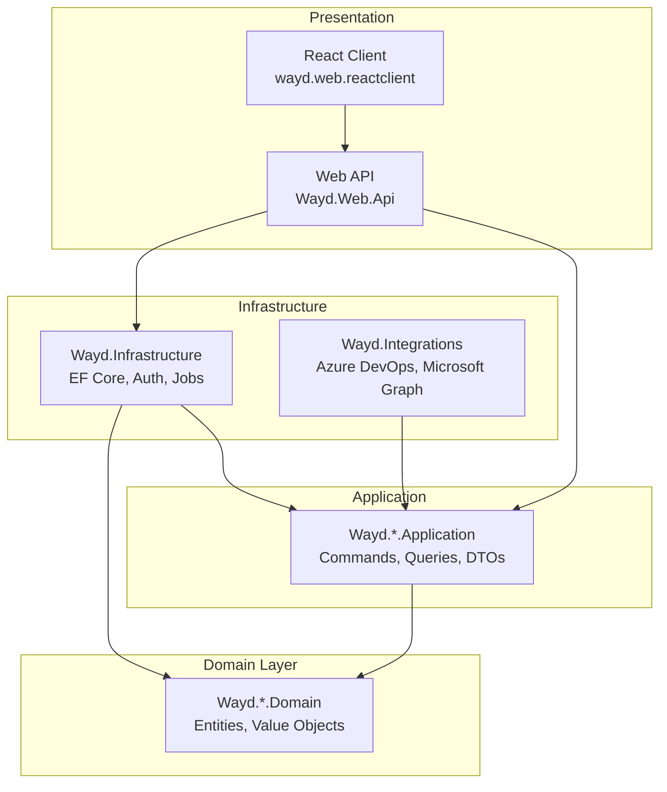

# Architecture

Wayd follows **Clean Architecture** with **Domain-Driven Design (DDD)** principles, organized as a **modular monolith** with a shared database.

## Clean Architecture Layers


```mermaid
graph TB
    subgraph "Presentation"
        API["Web API<br/>Wayd.Web.Api"]
        Client["React Client<br/>wayd.web.reactclient"]
    end
    subgraph "Infrastructure"
        Infra["Wayd.Infrastructure<br/>EF Core, Auth, Jobs"]
        Integrations["Wayd.Integrations<br/>Azure DevOps, Microsoft Graph"]
    end
    subgraph "Application"
        App["Wayd.*.Application<br/>Commands, Queries, DTOs"]
    end
    subgraph "Domain Layer"
        Dom["Wayd.*.Domain<br/>Entities, Value Objects"]
    end

    API --> App
    API --> Infra
    Infra --> App
    Infra --> Dom
    App --> Dom
    Client --> API
    Integrations --> App
```

### Dependency Rules

- **Domain** (innermost) - Zero external dependencies. Contains entities, value objects, domain events, and interfaces.
- **Application** - Depends on Domain only. Contains commands, queries, handlers, DTOs, and validators.
- **Infrastructure** - Depends on Application and Domain. Contains EF Core, authentication, background jobs, and external integrations.
- **Web API** - Depends on all layers. Thin controllers that delegate to handlers via `IDispatcher` (Wolverine).

These rules are enforced by automated architecture tests in `Wayd.ArchitectureTests`.

## Solution Structure

```
Wayd/
  Wayd.Common/           # Shared libraries and base abstractions
    Wayd.Common          # Utilities, extensions, helpers
    Wayd.Common.Domain   # Base entities, value objects, interfaces
    Wayd.Common.Application  # Base behaviors, validators, interfaces
    Wayd.Tests.Shared    # Shared test utilities and fakers

  Wayd.Services/         # Vertical slice domain services
    Wayd.Work/           # Work item management
    Wayd.Organization/   # Teams and employees
    Wayd.Planning/       # Iterations and planning intervals
    Wayd.Goals/          # Objectives and key results
    Wayd.AppIntegration/ # Integration configuration
    Wayd.Links/          # Cross-entity relationships
    Wayd.StrategicManagement/   # Strategic planning
    Wayd.ProjectPortfolioManagement/  # Project portfolios

  Wayd.Infrastructure/   # Cross-cutting concerns
  Wayd.Integrations/     # External system integrations
  Wayd.Web/              # Presentation layer
```

## Key Patterns

### CQRS with Wolverine

All business operations are modeled as commands (writes) or queries (reads), dispatched through `IDispatcher` (backed by Wolverine). Controllers are thin and contain no business logic. Handlers must be `public` — Wolverine generates the code that invokes them and cannot call internal types.

Handler **dependencies** are constructor-inlined by Wolverine's codegen, and service location is disabled (`ServiceLocationPolicy.NotAllowed`). A dependency whose registered implementation is `internal` (public interface, internal class) cannot be inlined; it must be added to the `AlwaysUseServiceLocationFor<T>()` allow-list in `WolverineConfiguration` — or the implementation made public. Getting this wrong is caught early: `codegen write` (run by the Debug post-build target and the CI staleness check) fails with an `InvalidServiceLocationException` naming the offending type.

```csharp
// Command
public sealed record CreateWorkItemCommand(string Title, Guid WorkspaceId) : ICommand<Guid>;

// Query
public sealed record GetWorkItemQuery(Guid Id) : IQuery<WorkItemDto>;
```

### Result Pattern

Handlers return `Result&lt;T&gt;` from CSharpFunctionalExtensions instead of throwing exceptions:

```csharp
public async Task<Result<Guid>> Handle(CreateWorkItemCommand request, CancellationToken ct)
{
    var workspace = await _context.Workspaces.FindAsync(request.WorkspaceId);
    if (workspace is null)
        return Result.Failure<Guid>("Workspace not found.");

    var workItem = workspace.CreateWorkItem(request.Title);
    return Result.Success(workItem.Id);
}
```

### Identity vs Principal

The current caller is split into two abstractions: `ICurrentUser` is pure identity — *who* is calling (user id, name, email, employee link, authenticated) — and `ICurrentPrincipal` answers *what the caller may do* (`HasPermission` / `HasAnyPermission`), deriving the permission set from the identity plus the permission store and caching it per request/message scope. Inject the one that matches the question being asked; don't add permission or claim APIs to `ICurrentUser`.

`ICurrentUser.Kind` classifies the caller as one of three `ActorKind`s: **User** (an authenticated request, or a background scope acting on a specific user's behalf), **Anonymous** (a live HTTP request with no authenticated user — denied all permissions), or **System** (no HTTP request and no acting user: scheduled jobs, durable message delivery, startup work — granted all permissions). System scopes are audited with the well-known `SystemIdentity.UserId` instead of an empty value, so platform-initiated writes are always attributable.

Only real user ids are propagated across execution boundaries (job parameters, message envelope headers); a scope with neither an HTTP context nor a propagated user id resolves to System by definition — the "nobody = system" rule lives in `CurrentUser.Kind` and nowhere else. This rests on one assumption worth knowing: **background work never originates from anonymous callers.** Anonymity doesn't survive a detach — once execution leaves the HTTP context with no user id, an anonymous origin is indistinguishable from a platform origin, so work enqueued by an anonymous endpoint would run as System (grant-all). Today no anonymous endpoint enqueues work; if one ever must, propagate an explicit anonymous marker so `Kind` can resolve it correctly across the boundary.

### Permission-based vs membership-based authorization

Most of the application authorizes on the permission claim alone: a `[MustHavePermission]` attribute on the controller decides whether the caller may reach the endpoint, and the handler does the work.

**PPM is the exception.** Changing a project, program, or portfolio additionally requires that the caller *leads* the record — Owner or Manager on it or on an ancestor. That question can only be answered against the record itself, so it is enforced **in the domain**, not at the controller:

- The command record implements `IRequireLinkedEmployee` — a managed PPM action is always attributable to an employee.
- The handler resolves a `PpmActor` via `ResolvePpmActor(ICurrentUser, CancellationToken)` on `ICurrentPrincipal`, pairing the employee id with whether they hold the domain-wide administrator grant, plus the acting user id. It takes `ICurrentUser` alongside the principal rather than reading the user id from it, because the two interfaces are a deliberate identity/authorization split — `ICurrentPrincipal` answers only what the caller may do. The user id is carried because records that freeze attribution at write time (such as project status history) need both: the user-to-employee link is mutable, so an action attributed only by employee cannot later be traced to the account that performed it.
- The handler's query **must load the ancestor roles** — `Portfolio.Roles`, and `Program.Roles` when assigned — and pass them in as `ProjectAncestryRoles`.
- The aggregate method checks `CanManageProject` / `CanManageProgram` / `CanManagePortfolio` before any state change.

Every mutating method on those three aggregates takes a `PpmActor`; there is no ungated public overload, so the compiler will not let a new handler forget. Paths with no human actor (importers, creation) pass `PpmActor.System` — grep for it to audit every membership bypass in the codebase.

:::warning Forgetting an `.Include` fails silently
`AncestryRoles()` reads `project.Portfolio?.Roles ?? []`. If the handler's query omits the ancestor includes, the navigation is null, ancestry comes back empty, and a legitimately authorized portfolio Owner is **denied** — with no error to trace. Unit tests using in-memory fakes cannot catch this, because `.Include` is a no-op there and the test populates the navigation directly.
:::

The read side mirrors the same rule as `canManageProject` / `canManageProgram` / `canManagePortfolio` DTO fields so the UI can hide actions the server would reject. Those projections and the aggregate predicates must agree — if they drift, the UI either hides valid actions or offers ones that fail on submit.

`ProjectDetailsDto.BackwardStatusTargets` follows the same principle for [reverting a project's status](../user-guide/ppm/projects.mdx#reverting-a-project-status): rather than the UI re-deriving which earlier statuses are reachable, the server answers from `ProjectStatusLifecycle` — the same table and entry requirements `Project.RevertStatus` enforces. Adding a status requirement in one place without the other is what makes the dropdown offer a transition that then fails.

:::warning Not every derived field can be computed in the projection
`GetProjectQuery` builds its DTO with `ProjectToType`, so every mapping clause must translate to SQL. `BackwardStatusTargets` cannot — building it calls a static factory inside a `Select` over a collection — so the mapping `.Ignore`s it and `ResolveBackwardStatusTargets()` fills it after materialisation. A clause that fails to translate throws only under a real provider; in-memory fakes run the projection as LINQ-to-Objects and evaluate anything, so changes to this mapping need a test in `Wayd.ProjectPortfolioManagement.IntegrationTests`.
:::

See [Permissions](../user-guide/settings/permissions.mdx) for the user-facing rule.

### No Repository Pattern

Application handlers use EF Core `DbContext` directly for data access. There is no repository abstraction layer.

### Vertical Slices

Each service follows consistent Domain/Application layering:

```
Wayd.Services/Wayd.\{ServiceName\}/
  src/
    Wayd.\{ServiceName\}.Domain/        # Entities, value objects, interfaces
    Wayd.\{ServiceName\}.Application/   # Commands, queries, DTOs, validators
  tests/
    Wayd.\{ServiceName\}.Domain.Tests/
    Wayd.\{ServiceName\}.Application.Tests/
```

### Feature Folders

Application layer is organized by aggregate root/feature:

```
Wayd.Work.Application/
  WorkItems/
    Commands/
      CreateWorkItemCommand.cs
      CreateWorkItemCommandValidator.cs
    Queries/
      GetWorkItemQuery.cs
    Dtos/
      WorkItemDto.cs
```

### Cross-domain replication

Domains do **not** share entity rows. Each domain keeps its own local projection of concepts owned by
another domain, kept aligned two ways:

1. **Event replication (copy).** The owning domain raises a domain event; consuming domains have
   public handlers with a `Handle(TEvent, CancellationToken)` method that create a local projection carrying the **same Id**.
   For example, `Organization.Team` is the source of truth; `PpmTeam`, `PlanningTeam`, and `WorkTeam` are
   read-model copies written by handlers for `TeamCreated`/`Updated`/`Activated`/`Deactivated`/`Deleted`.
   Every handler is idempotent (`if (await ctx.X.AnyAsync(x => x.Id == evt.Id)) return`).
2. **Shared table.** `Employee` lives in `Wayd.Common.Domain` — one row, referenced by Guid everywhere.
   No replication needed.

#### Replication edges

| Source domain | Aggregate | Event(s) | Consumers (projection written) |
|---|---|---|---|
| Organization | `Team` / `TeamOfTeams` | `TeamCreated/Updated/Activated/Deactivated/Deleted` | PPM `PpmTeam`, Planning `PlanningTeam`, Work `WorkTeam` |
| PPM | `Project` | `ProjectCreated/DetailsUpdated/Deleted` | Work `WorkProject` |
| StrategicManagement | `StrategicTheme` (**the source**) | `StrategicThemeCreated/Updated/Deleted` | PPM `PpmStrategicThemes` |
| Planning | `Iteration` | `IterationCreated/Updated/Deleted` | Work `WorkIteration` |
| Common | `Employee` | — (shared table) | referenced by Guid everywhere |

`StrategicTheme` is owned by **StrategicManagement**; PPM only holds a copy — author themes in
StrategicManagement.

#### The load-bearing consequence

Because these projections are populated by events, code that **creates** a replicated concept must go
through the owning domain's command so its `SaveChanges` dispatches the events — never insert a projection
row directly. The timing matters: `TeamCreatedEvent` and `StrategicThemeCreatedEvent` fire via
`AddPostPersistenceAction` (after the source aggregate saves), and consumers such as
`PlanningInterval.SetTeams(teamIds)` add `PlanningIntervalTeam { TeamId }` with **no existence check** — so
the replicated `PlanningTeam` row must already exist or the save FK-faults. Creating through commands keeps
this ordering correct for free; bulk operations (e.g. the [data generation tool](./tools/data-generation.mdx))
must create per row via the domain path plus one `SaveChanges`, never a raw `AddRange`.

### Activity log

Every domain event drained by `SaveChanges` is also captured as an `ActivityLogEntry` row — automatically,
in `BaseDbContext` via `ActivityLogEntryFactory`, with no per-aggregate wiring. An event implementing
`IAggregateEvent` declares the aggregate type and id the entry belongs to; anything else falls back to the
raising entity's type name and id. That is what the record pages' **Activity** section reads.

Capture happens whether the event is routed durably or inline, and `EventPublisher` treats a
subscriber-less event as a no-op. **A new event therefore earns a full audit trail without a handler and
without a `DurableEventRoutes` entry** — add it to that allow-list only when a real consumer needs it
delivered asynchronously.

#### Every raise is a fact; nothing collapses them

`BaseEntity` offers one way to raise. A domain method that changed something raises an event, and that
event survives — two calls that each changed something are two facts, and the aggregate does not try to
work out that only the last one "really" counts.

It once had a second method that dropped any pending event of the same type, so that replacing a project's
role list twice in one request recorded a single net change. That was wrong for a reason worth
remembering: **the aggregate cannot see the save boundary.** Events are drained and cleared by
`SaveChanges`, so the same two domain calls recorded one entry or two depending on where the handler
happened to put its save — a persistence detail deciding what the business record says. And "the earlier
state was never committed" is a persistence claim about a state the aggregate genuinely held.

What keeps the log clean is not collapsing events after the fact but not raising them in the first place —
see below.

#### A change carries both ends

An event that records a change carries the value before as well as the value after. The change is the
fact, and a consumer should not have to find an earlier event to learn what moved: "reverted from Active"
cannot be recovered from the new status alone, and the earlier event may be one the consumer never
received. Status changes carry `From*` and `To*`; timeline changes carry `PreviousDateRange`; lifecycle
and scoring-model changes carry the previous id and name. A ledger entry — a health check added, a score
recorded — is a new row rather than a value moving, so it has only one end.

Adding the previous value to a published event is a compatible change, a minor version, and a payload
written before it reads the new field as `default`. Make sure `default` can only mean "not recorded". A
flat `PreviousBusinessCase` could not: a business case may genuinely have been empty. So the
`*DetailsUpdatedEvent`s group what they replaced as one `Previous` record, which is null only on an older
payload, and the nulls inside it are real.

Collections carry both the change and its result, because they serve two kinds of consumer. `Added` and
`Removed` are the fact — who gained and who lost which role, which themes were tagged and untagged — and
are what a consumer reacting to the change needs ("tell the new Owner"). `Roles` and `StrategicThemes` are
the set afterwards, in the encoding the `Created` events use, and are what a consumer keeping a copy needs:
applying the latest set is correct however deliveries were ordered or repeated, whereas applying deltas in
the wrong order produces the wrong set. The two are redundant by design; the full set is what makes a
replica self-healing.

#### A payload carries the change and the identity, not a description of the record

A payload holds what changed plus the identity needed to locate the aggregate — `Id`, and `Key` where the
record has one, since that is how the UI and the importers address it. It does **not** carry the record's
`Name`. A name is a reference to the aggregate rather than a fact of the event, it goes stale against the
record, and because the Activity section diffs an entry against the previous one, a rename otherwise shows
up inside the diff of an unrelated change.

The exception is where the name *is* the change: `*CreatedEvent` and `*DetailsUpdatedEvent` carry it,
because "created as X" and "renamed to X" are the facts those events record — and the Work module builds
its `WorkProject` projection straight off those two payloads. The same reasoning keeps a name on
`StrategicInitiativeDeletedEvent`: the record is gone, so the payload is the only remaining description of
what stopped existing.

A record's display label for the activity log is a separate, unsolved concern. The conventional home for
it is the envelope — `ActivityLogEntry` already carries `AggregateType` and `AggregateId` and would gain a
label alongside them, the way CloudEvents uses `subject` — rather than a `Name` repeated through every
payload.

#### The aggregate decides whether anything changed

An event is raised only when the call actually changed something. A whole-record update sends every field
on every save, so a method that raises because its code path ran records "the roles changed" on an edit
that touched only the description — and the entries that did change something get buried.

That decision belongs to the **aggregate**, not to `SaveChanges`. EF's change tracker knows which columns
are dirty and could drive it, but that would put a persistence mechanism in charge of what counts as a
business fact — the same objection that applies to inferring events from the change tracker at commit
time. It also cannot express "these five properties together mean one `DetailsUpdated`", and it does not
see a role-assignment collection change as a property change at all.

The comparison runs **after** assignment, never against the arguments:

```csharp
var before = new ProgramDetails(Name, Description);

Name = name;              // the setters Guard, then Trim
Description = description;

if (before != new ProgramDetails(Name, Description))
{
    AddDomainEvent(new ProgramDetailsUpdatedEvent(this, before, actor.ToEventActor(), timestamp));
}
```

`Name` and `Description` normalise in their setters, so `if (Name == name)` reports a change when a caller
passes `"Atlas "` and `"Atlas"` is stored — raising an event whose payload is identical to the one before
it. Comparing the stored values on both sides is what makes the guard correct rather than merely present.

Collections compare the same way, ignoring order: `RoleManager.Diff` for role assignments (the event is
raised when it gained or lost anything, and carries both lists), a set difference for strategic themes.

#### Versioning an event

An event's published shape is a contract with two kinds of reader, and each forces a rule:

- **Stored payloads are read by current code, forever.** The activity log is append-only and nothing
  migrates a payload once written, so every event must stay readable by every later version of itself.
- **Published events are read by consumers written against the shape they were published with.** Assume
  every event has such a consumer, whether or not one is subscribed today — the routing table is a
  deployment detail, not the contract.

Every event declares its version explicitly (`base(actor, "1.0")`). What a change does to it:

| Change | Result |
|---|---|
| Add a field whose `default` is a valid value | Same type, minor bump: 1.0 → 1.1 |
| Add a field whose `default` is not a valid value | Not compatible — see the next row |
| Remove, retype, or repurpose a field | New type at the next generation: `XxxEventV2`, `"2.0"` |

**Why a breaking change is a new type rather than a major bump on the same one.** Consumers dispatch on the
type. A `"2.0"` payload of the same type still reaches every consumer written against `"1.0"`, and with
System.Text.Json a member the payload no longer carries binds to `default` without error — so the
consumer receives a `null` where its type promised a value. The version number labels that break but
protects nobody unless every consumer checks it before deserializing. A new type is the only thing that
keeps an old consumer from receiving a shape it cannot read. The type suffix carries the major version;
`EventVersion` carries it too, so the log reads correctly on its own, and its minor carries the compatible
revisions within that generation.

**The superseded type is frozen, never deleted.** It is marked `[Obsolete]` so nothing raises it, and its
published shape and class name stay exactly as they were — payloads written as it must still deserialize,
and `ActivityLogEntry.EventType` stores the class name, so renaming it would orphan every existing row. A
consumer handles both generations until nothing can still deliver the old one: `ProjectSyncHandler` keeps
its `ProjectKeyChangedEvent` handler for envelopes written before the switch and still in the outbox.

The activity log's summary drops the generation suffix, so `ProjectReparentedEventV2` still reads
"Project Reparented"; `EventType` keeps it, because that is what consumers dispatch on.

**Avoid needing a new generation.** Most breaking changes can be made compatible by adding before removing:
add the replacement field, move consumers onto it, and retire the old field in a later generation only if
you still need to. Design payloads so they survive the changes you can see coming —
`ProjectStatusChangedEventV2` carries a status as a name plus a `LifecycleCategory` rather than an enum
value, so workflow-configurable statuses will not break it.

`DomainEventVersioningTests` enforces two of these rules across every event: the type's generation and its
version's major must agree, and every superseded generation must still exist and be `[Obsolete]`. The rest —
that a new field's `default` is valid, that a frozen type's shape never moves — only a stored golden payload
can prove; `ProjectReparentedEvent_PayloadWrittenBeforeItWasSuperseded_StillDeserializes` is the pattern.

#### Sharing an id with the record a transition writes

`ProjectStatusChangedEventV2` takes its `EventId` from the `ProjectStatusHistory` row that recorded the
transition, rather than a fresh value. The two describe one fact, and sharing an identity is what lets
history written before the event existed be replayed into the log exactly once — the
`Backfill-Project-Status-Activity` migration inserts `WHERE NOT EXISTS (… WHERE Id = h.Id)`, so it can
never duplicate a transition that already raised its own event. The identity holds across generations:
the backfill writes its rows as the frozen `ProjectStatusChangedEvent` and live transitions raise V2, and
both take the row's id. Reach for this wherever an aggregate writes both a durable record and an event
about the same occurrence.

Only `Project` has such a record. `Program` and `ProjectPortfolio` assign their status directly, so
`ProgramStatusChangedEvent` and `ProjectPortfolioStatusChangedEvent` take fresh ids and their Activity
sections start from the release that introduced them — there is no row to share an id with and nothing to
backfill from. Adding a history table to either is a separate decision, not a gap in this one.

Reading is an `IActivityLogReader` **service**, not a standalone query. Each module writes its own thin
query handler that resolves and authorizes its record first, then reads the history inside that record's
security boundary:

```csharp
var projectId = await _ppmDbContext.Projects
    .Where(request.IdOrKeyFilter)
    .Select(p => (Guid?)p.Id)
    .FirstOrDefaultAsync(cancellationToken);

if (projectId is null)
{
    return Result.Success<PagedResponse<ActivityLogDto>?>(null);
}

var activities = await _activityLogReader.Read(
    projectId.Value, aggregateType: "Project", page: request.Page, pageSize: request.PageSize,
    cancellationToken: cancellationToken);
```

A generic `/api/activities?aggregateId=` endpoint would have to re-derive which permission guards which
aggregate type; this way the module that already knows answers it, and the controller carries the same
`[MustHavePermission]` as the record's own GET.

**The aggregate type is the event's, not the entity's.** Two cases differ today and both are load-bearing:
a `TeamOfTeams` raises the same `Team*` events, so its entries carry `"Team"` and only the id separates
them; and `StatusWorkflow`'s events name the aggregate `"Workflow"`. Reading with the entity's own class
name would silently return nothing. Adding an Activity section to a new record means checking what its
events actually declare — `grep 'AggregateType =>'` lists every value in use.

## Connector framework

Customer-configured integrations (Azure DevOps, Entra, Azure OpenAI, future Jira / GitHub / Workday connectors) plug into a shared framework in the `Wayd.AppIntegration` service, the `Wayd.Integrations.*` projects, and a frontend registry pair. The goal is that adding a connector is *additive* — drop in new files, register them, no edits to the generic plumbing.

Every connector declares its `ConnectorCapability` values (`WorkItems`, `People`, `AiProvider`) — a multi-surface connector can support several through one connection. The capability — not the specific connector type — determines which background runner picks the connection up and which Sync History view the detail page shows. Each capability carries a display category via `Display(GroupName)` that groups the connector picker UI.

### Backend shape

| Concern | Lives in | Pattern |
|---|---|---|
| Aggregate | `Wayd.AppIntegration.Domain/Models/` | `Connection<TConfiguration>` base; subclass per connector. Any connector that participates in a sync runner (work-sync or people-sync) implements `ISyncableConnection` to expose `SystemId` (nullable — return `null` if not applicable) and `CanSync` (`IsActive && IsValidConfiguration && HasActiveIntegrationObjects`). Both runners filter on `CanSync`. AI-provider connectors don't implement the interface — they aren't sync-runner-driven. |
| Configuration | `Wayd.AppIntegration.Domain/Models/.../*ConnectionConfiguration.cs` | Plain POCO stored as JSON. Mark credential fields with `[Encrypted]` (from `Wayd.Common.Domain.DataProtection`) so they're encrypted at rest by `EncryptingJsonValueConverter`. |
| Capability declaration | `Wayd.Common.Domain.Enums.AppIntegrations/ConnectorExtensions.cs` | Add an arm to `Connector.GetCapabilities()` declaring the capabilities the connector supports (a multi-surface connector declares several). The runners and detail-page actions dispatch by capability; each `ConnectorCapability` member's `Display(GroupName)` is the display category that groups the picker UI. |
| Commands / Queries | `Wayd.AppIntegration.Application/Connections/Commands/\{Connector\}/`, `.../Queries/` | One folder per connector. CQRS via Wolverine, validators via FluentValidation. Activate / Deactivate are connector-agnostic (`ActivateConnectionCommand` / `DeactivateConnectionCommand`) — don't re-implement them per connector. |
| Polymorphic DTO | `Wayd.AppIntegration.Application/Connections/Dtos/ConnectionDetailsDto.cs` | Add a `[JsonDerivedType]` entry; controllers switch on the request/DTO type to dispatch to the right handler. |
| Secret masking | `Wayd.AppIntegration.Application/Connections/Dtos/.../*ConfigurationDto.cs` | Implement a `Mask*` method that preserves the first 4 characters and the original length (matching `MaskPersonalAccessToken` / `MaskClientSecret` / `MaskApiKey`). The shared update-command pattern compares first-4-chars + length to detect "user posted back the masked value unchanged" and preserve the stored secret. |
| External client | `Wayd.Integrations.\{SystemName\}/` | Only if the connector actually talks to a remote API. Pure AI providers can wrap an existing SDK directly inside the application layer. |
| Persistence | `Wayd.Infrastructure/Persistence/Configuration/AppIntegrationConfiguration.cs` | TPH discriminator; one entity-config per concrete connection class. Use `HasEncryptedJsonConversion()` for the configuration column. |
| Connector module | `Wayd.Infrastructure/ConnectorModules/\{Connector\}ConnectorModule.cs` | One `IConnectorModule` per connector: declares its capabilities and registers all of its DI wiring (keyed sources, descriptor builders, init probes, HTTP clients) in one place. Discovered by assembly scan (`AddConnectorModules()`) — no edits to shared registration code. Architecture tests enforce one module per `Connector` value, capability agreement with `GetCapabilities()`, and a keyed source per declared sync capability. |
| Sync orchestration — work | `Wayd.Integrations.Abstractions/IWorkItemSource.cs` + `Wayd.AppIntegration.Application/Connections/Managers/\{Connector\}WorkItemSource.cs` | Implement `IWorkItemSource` for the connector and register it (keyed by `Connector` enum value) in the connector's module. The generic `WorkSyncRunner` calls every registered source on a single Hangfire schedule — no per-connector job. |
| Sync orchestration — people | `Wayd.Integrations.Abstractions/IEmployeeSource.cs` + `Wayd.AppIntegration.Application/Connections/Managers/\{Connector\}EmployeeSource.cs` + a descriptor builder | Implement `IEmployeeSource` for the connector (an adapter wrapping the low-level per-system service) plus an `ISyncableConnectionDescriptorBuilder`, and register both in the connector's module. The generic `PeopleSyncRunner` resolves sources via `EmployeeSourceFactory` — no runner edits. |
| Init probe (optional) | `Wayd.Integrations.Abstractions/IConnectionInitProbe.cs` | Connectors whose configuration warrants an upstream validation probe implement `IConnectionInitProbe` and register it keyed in their module. The connections controller's init endpoint resolves by key — a connector "supports an init probe" exactly when one is registered (Workday today). |

### Sync orchestration

Sync-shaped connectors plug into category-specific runners. Both runners follow the same shape: load active connections for their category, loop, write a `SyncRun` row per connection per run.

#### Work sync

Work-sync connectors (AzDO today, Jira/GitHub in future) plug into a single generic runner. The pieces:

- **`IWorkItemSource`** ([Wayd.Integrations.Abstractions](https://github.com/destacey/Wayd/tree/main/Wayd.Integrations/src/Wayd.Integrations.Abstractions)) — connector-neutral contract: `TestConnection`, `GetSystemId`, `RefreshOrganizationConfiguration`, `GetSyncPlan` (returns a flat list of `WorkspaceSyncTarget`), `PrepareWorkspaceForItemSync`, `SyncIterations`, `SyncWorkItems`. Sources hide connector-specific hierarchy internally — AzDO's `WorkProcess → Workspace` walk happens inside `GetSyncPlan`, the runner only sees workspaces.
- **`IWorkItemSourceFactory`** — resolves the right source per connection via keyed DI. Sources hold credentials internally after `Bind(descriptor)` so per-call signatures stay credential-free.
- **`WorkSyncRunner`** ([Wayd.AppIntegration.Application/Connections/Managers/WorkSyncRunner.cs](https://github.com/destacey/Wayd/blob/main/Wayd.Services/Wayd.AppIntegration/src/Wayd.AppIntegration.Application/Connections/Managers/WorkSyncRunner.cs)) — loops all active syncable connections, resolves each source via the factory, walks the flat plan, runs `ProcessDependenciesCommand`, and writes a `SyncRun` row per connection per run (`AppIntegrations.SyncRuns`). Per-connection failures don't kill the run; per-workspace failures don't kill the connection.
- **Hangfire entry point**: `JobManager.RunWorkSync(SyncType, SyncTriggerSource, Guid? connectionId, CancellationToken)` — one job for all work-sync connectors. `connectionId = null` runs every active syncable connection (manual via `BackgroundJobType.WorkFullSync` / `WorkDiffSync`, or scheduled). Passing a `connectionId` runs that connection only (manual "Sync now" from the connection detail page). `[DisableConcurrentExecution]` is keyed on the method, so all variants serialize against each other.

One-time initialization flows (e.g. AzDO's `InitWorkProcessIntegration` / `InitWorkspaceIntegration`) stay connector-specific in the existing init manager — they're user-triggered setup wizards with connector-specific payloads, not part of the generic runner.

#### People sync

People-sync connectors (Entra and Workday today, BambooHR/Okta in future) follow the same shape as work sync but simpler — there's no per-target sync plan, every active connection just fetches its employees and feeds them into the existing connector-agnostic `BulkUpsertEmployeesCommand`. The pieces:

- **`IEmployeeSource`** ([Wayd.Integrations.Abstractions](https://github.com/destacey/Wayd/tree/main/Wayd.Integrations/src/Wayd.Integrations.Abstractions)) — connector-neutral contract: `Bind(descriptor)`, then `GetEmployees(Instant? since, ct)` returning employees plus a neutral exclusion breakdown. Behavior modifiers live on the port: `SupportsIncremental` (can the source return deltas) and `MatchBy` (which employee property the upsert *prefers* to key on, read from the bound configuration — the upsert falls back to the other candidate key on a miss). Implementations are adapters in `Wayd.AppIntegration.Application/Connections/Managers/` (`EntraEmployeeSource`, `WorkdayEmployeeSource`) that wrap the low-level per-system services (`IEntraEmployeeSource`, `IWorkdayEmployeeSource`) — the same layering as `AzureDevOpsWorkItemSource` wrapping `IAzureDevOpsService`. Sources build their own per-connection client at call time — there is no shared app-wide client, so multiple connections of the same type (e.g. two Entra tenants) work without conflict.
- **`IEmployeeSourceFactory`** — resolves the right source per connection via keyed DI and calls `Bind`, mirroring `IWorkItemSourceFactory`. Descriptor builders (`ISyncableConnectionDescriptorBuilder`, shared with work sync) load the typed entity and box its configuration.
- **`PeopleSyncRunner`** ([Wayd.AppIntegration.Application/Connections/Managers/PeopleSyncRunner.cs](https://github.com/destacey/Wayd/blob/main/Wayd.Services/Wayd.AppIntegration/src/Wayd.AppIntegration.Application/Connections/Managers/PeopleSyncRunner.cs)) — loops all active connections with the People capability, resolves each source via the factory (the runner never names a concrete connector), sends `BulkUpsertEmployeesCommand`, then calls `IUserService.UpdateMissingEmployeeIds` and `SyncUsersFromEmployeeRecords`. Writes a `SyncRun` row per connection per run; per-connection details (`employeesFetched`, `employeesUpserted`, `employeesExcluded`, `errors[]`) are serialized to `SyncRun.DetailsJson`.
- **Hangfire entry point**: `JobManager.RunPeopleSync(SyncType, SyncTriggerSource, Guid? connectionId, CancellationToken)`. `connectionId = null` runs every active people-sync connection (manual via `BackgroundJobType.PeopleFullSync` / `PeopleDiffSync` or scheduled). Passing a `connectionId` runs that connection only (manual "Sync Now" from the connection detail page).

Differential people sync is source-dependent: when the source declares `SupportsIncremental` (Workday today), a differential run passes the last successful run's timestamp as the watermark and skips the deactivation pass (missing from a delta means "no changes", not "no longer exists"). Sources without incremental support (Entra) transparently degrade every run to a full snapshot, and `BulkUpsertEmployeesCommand` is idempotent.

#### Why no shared `IConnectorSource<TItem>`

Work-sync and people-sync runners look superficially similar but their per-target shapes diverge: work sync walks a workspace plan with per-workspace metrics; people sync is a single fetch-then-upsert per connection. Forcing both behind one generic interface would create a `TConnectionState` / `TItem` / `TSyncTarget` mess that hurts readability without removing duplication (the duplication is ~30 lines of `SyncRun` bookkeeping, which is cheap). Keep the two runners separate; share the `SyncRun` entity and the category-routed controller actions.

### Frontend shape

The connector UI is registry-driven on both the create and detail surfaces:

| Concern | File | What to add |
|---|---|---|
| Create form section | `Wayd.Web/src/wayd.web.reactclient/src/app/settings/connections/_components/connector-registry.ts` | Map the `ConnectorType` enum value to your configuration form component. |
| Connector type metadata | `Wayd.Web/src/wayd.web.reactclient/src/types/connectors.ts` | Add to the `ConnectorType` enum + `CONNECTOR_NAMES` / `CONNECTOR_DESCRIPTIONS` maps. |
| Detail page | `Wayd.Web/src/wayd.web.reactclient/src/app/settings/connections/[id]/_components/detail-registry.tsx` | Register a `DetailEntry` for the new connector. Provide a `Details` component (or use `GenericConnectionDetails` as a fallback). Optional: `extraTabs`, `ExtraActions` (connector-specific menu items), `Wrapper` (if your detail UI needs a context provider), `EditForm` (if the shared edit form doesn't fit). |
| Per-connector subfolder | `Wayd.Web/src/wayd.web.reactclient/src/app/settings/connections/[id]/\{connector\}/` | All connector-specific components live here. Export the registry entry from `index.tsx`. |

The generic edit / delete / list flows handle every connector automatically. Only build connector-specific UI when the connector genuinely needs it (e.g. Azure DevOps has its workspace/team mapping flow; AI providers don't).

### Why a registry instead of a plugin system

There are few connectors (today 3, plausibly 10-20 long-term) and the team owns them all. A static registry catches misregistration at compile time, keeps the bundle predictable, and is trivial to refactor. If Wayd ever opens connectors to third-party authors, revisit then.
