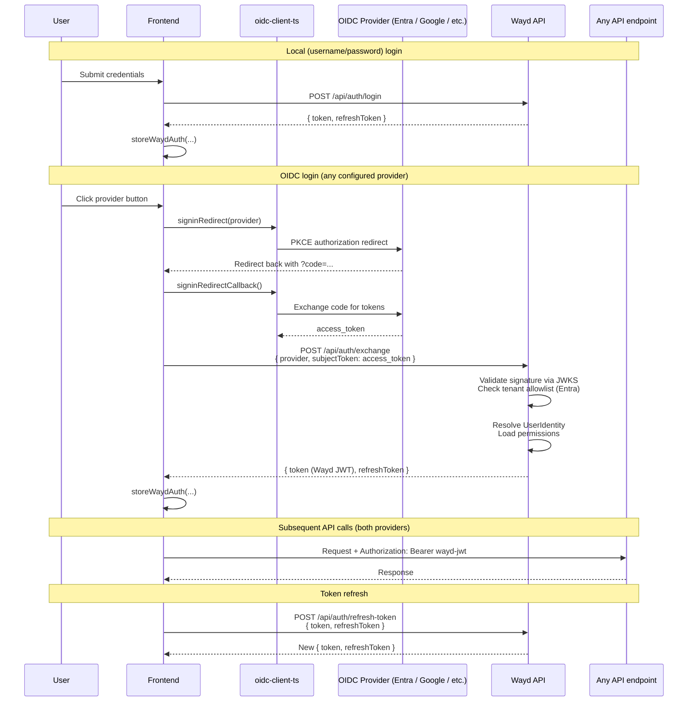
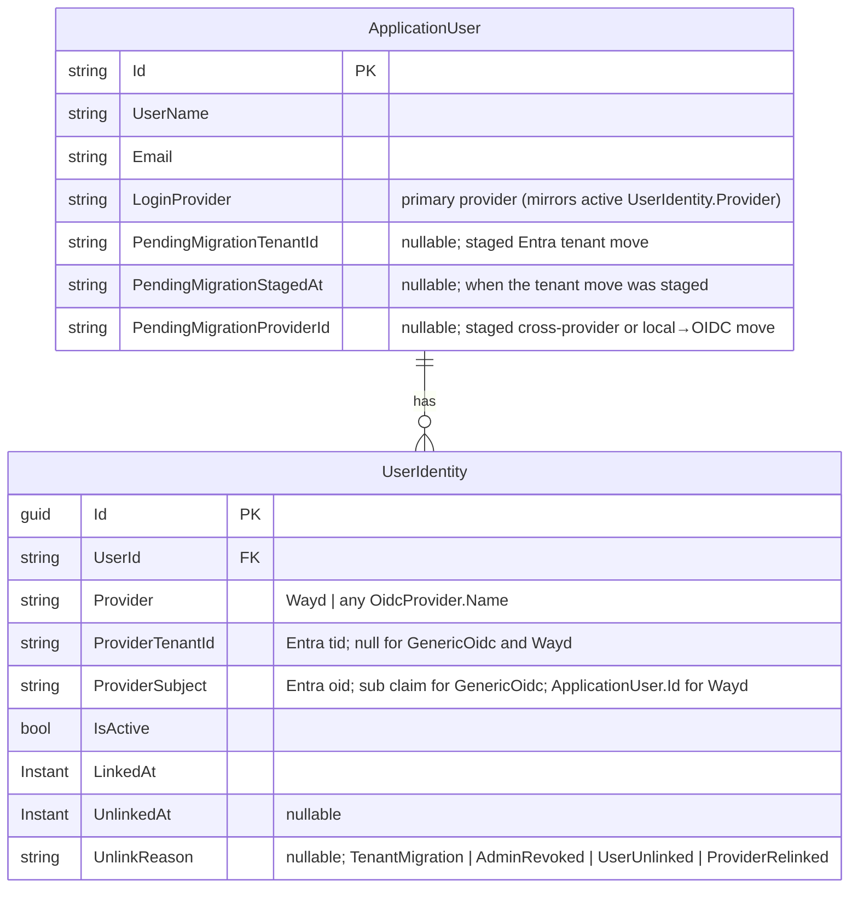

# Configuration

## Database

Database connection strings are configured in:

```
Wayd.Web/src/Wayd.Web.Api/Configurations/database.json
```

## Authentication

Wayd supports two authentication paths:

- **Local (username + password)** — always available, configured per-deployment via JWT signing settings.
- **Identity providers (OIDC)** — Microsoft Entra ID and any standards-compliant OIDC provider (Google, Okta, Auth0, Keycloak, …). Providers are stored in the database and managed by admins through the Settings UI; no app restart is needed to add, edit, enable, or disable one.

:::tip First deployment?
If this is a fresh deployment with no users yet, see [First-Run Setup](./first-run-setup.mdx) to create the initial administrator account before configuring identity providers.
:::

### Identity providers (DB-managed)

Each row in the `Identity.OidcProviders` table is one configured provider — its discovery `Authority`, public `ClientId`, expected token `Audience`, scopes, and (for Entra) the allowed-tenant list. The token-exchange endpoint resolves provider metadata from this table on every request, with a short cache TTL and explicit invalidation on admin writes.

The database is the single source of truth for identity providers — there is no config-file or environment-variable equivalent. Providers are created and edited entirely through the admin UI.

**Managing providers.** Once the `IdentityProviders` feature flag is enabled, admins with the `Permissions.OidcProviders.{View|Create|Update|Delete}` permissions can manage providers from **Settings → Identity Providers**. The "Test connection" button fetches the provider's `.well-known/openid-configuration` document so typos in `Authority` are caught at configuration time, not at the user's next login.

| Provider field | Purpose |
| --- | --- |
| `Name` | Stable key written into `UserIdentity.Provider`. Immutable post-create. Reserved value `"Wayd"` (local accounts). |
| `DisplayName` | Human-readable label rendered on the login page. |
| `ProviderType` | `MicrosoftEntraId` (multi-tenant via `/common/`, tenant allowlist) or `GenericOidc` (single-issuer, no tenant check). Immutable post-create. |
| `Authority` | OIDC issuer URL. Must be `https`. Wayd appends `/.well-known/openid-configuration` for discovery. |
| `ClientId` | Public OAuth client ID. Surfaced to the frontend so the OIDC client can be constructed. |
| `Audience` | Pinned `aud` claim on incoming tokens. See **Finding your Audience** below. |
| `Scopes` | OAuth scopes the frontend requests when initiating sign-in. |
| `AllowedTenantIds` | **Entra only.** Empty/null rejected at the entity level. Tokens whose `tid` (or issuer-derived tenant) is not in this list are rejected. Ignored for `GenericOidc`. |
| `ClockSkewSeconds` | Tolerance for expiry/not-before checks. Defaults to 60; range `[0, 600]`. |
| `IsEnabled` | Disabled providers are hidden from the login page; exchange attempts against them return 401. |
| `AllowAutoRegistration` | Master switch for just-in-time user provisioning. Defaults to **`false`** (secure by default). When off, an unknown user signing in is rejected and must be pre-created by an admin. See [User provisioning](#user-provisioning-auto-registration). |
| `RequireEmployeeRecord` | When auto-registration is on, gates it to users whose email matches an existing employee. `true` (the safer default) lets only known employees self-register; `false` grants an account to anyone who can authenticate. Ignored when `AllowAutoRegistration` is off. |
| `DefaultRoleId` | Role assigned to users auto-created through this provider. **Required** when `AllowAutoRegistration` is on (no implicit fallback). Protected by a FK: a role pinned here cannot be deleted until the provider is repointed. Null/ignored when `AllowAutoRegistration` is off. |

**Adding a Microsoft Entra ID provider.** From **Settings → Identity Providers**, choose **Add provider → Microsoft Entra ID** and fill in:

| Field | Value |
| --- | --- |
| `Authority` | `https://login.microsoftonline.com/{your-tenant-id}/v2.0` for a single tenant; `https://login.microsoftonline.com/common/v2.0` only for true multi-tenant deployments where users from multiple Entra tenants sign in (`/v2.0` suffix required). |
| `ClientId` | The **client (SPA) app registration's** client ID, presented to Entra when initiating sign-in. |
| `Scopes` | The standard OIDC scopes plus your API scope, e.g. `openid profile email api://{api-client-id}/access_as_user` — the API scope makes Entra issue an access token with `aud = {api-client-id}`. |
| `Audience` | The **API app registration's** client ID, pinned as the expected `aud` claim. See **Finding your Audience** below. |
| `AllowedTenantIds` | The Entra tenant ID(s) permitted to sign in. Must be non-empty. |

The client ID and API client ID are different values because Wayd follows Entra's standard two-registration pattern (see [Entra App Registration Setup](./entra-app-registration.mdx)).

:::tip Setting up a new environment
If you don't yet have an Entra app registration for this deployment, follow [Entra App Registration Setup](./entra-app-registration.mdx) first. That walks through creating the two app registrations (API + client), choosing the right token version, and collecting the GUIDs referenced above.
:::

**Finding your Audience.** When entering the `Audience` in the Settings UI, the `aud` claim shape depends on the token version your app registration issues:

- **v2.0 tokens** (`api.requestedAccessTokenVersion: 2` in the app manifest): `aud` is the bare `<ClientId>` GUID. This is what Wayd expects.
- **v1.0 tokens** (the default for older registrations, or when `api.requestedAccessTokenVersion` is `null`/`1`): `aud` is `api://<ClientId>` or `api://<ClientId>/access_as_user`.

Don't guess — decode a real token at [jwt.ms](https://jwt.ms) and copy the `aud` value verbatim. A mismatch here rejects every exchange attempt with a 401, which is hard to diagnose after the fact. If you're seeing `api://` in a token you expected to be v2-shaped, flip `api.requestedAccessTokenVersion: 2` per the [app registration guide](./entra-app-registration.mdx#set-the-token-version-to-v2).

### Local Authentication

Configure in `Wayd.Web/src/Wayd.Web.Api/Configurations/security.json` or User Secrets:

```json
{
    "SecuritySettings": {
        "LocalJwt": {
            "Secret": "<strong-random-secret-at-least-32-chars>",
            "Issuer": "https://wayd.dev",
            "Audience": "https://api.wayd.dev",
            "TokenExpirationInMinutes": 60,
            "RefreshTokenExpirationInDays": 7
        }
    }
}
```

Only `Secret` needs to be set per deploy — the rest have sensible defaults and in particular `Issuer` / `Audience` are JWT claim identifiers, not environment-specific config. Don't override them per environment.

### Data Protection (at-rest secret encryption)

Connector credentials (Azure DevOps PATs, AI API keys, future OAuth refresh tokens) are encrypted at rest before being written to the `Connections` table. Encryption uses AES-256-GCM with a per-row random nonce; the master key lives in configuration.

Configure in `Wayd.Web/src/Wayd.Web.Api/Configurations/security.json` or User Secrets:

```json
{
    "SecuritySettings": {
        "DataProtection": {
            "MasterKey": "<base64-encoded 32-byte AES key>"
        }
    }
}
```

Generate the key with:

```bash
openssl rand -base64 32
```

User Secrets for local dev:

```bash
cd Wayd.Web/src/Wayd.Web.Api
dotnet user-secrets set "SecuritySettings:DataProtection:MasterKey" "$(openssl rand -base64 32)"
```

:::warning Key loss is unrecoverable
This is a **data-encryption** key, not a signing key. If you lose or change it, every connector credential stored in the database becomes undecryptable AEAD garbage — customers must re-enter every PAT and API key. Treat it as write-once for the lifetime of the data. Keep a backup outside the deployment system (password manager, sealed vault).

This is also why `MasterKey` must be **separate** from `LocalJwt:Secret` — JWT secrets are cheap to rotate (sessions die, nothing else); data keys are not. Per [NIST SP 800-57 §5.2](https://nvlpubs.nist.gov/nistpubs/SpecialPublications/NIST.SP.800-57pt1r5.pdf), "a key shall be used for only one purpose."
:::

In-product key rotation is tracked as a roadmap item ([#595](https://github.com/destacey/Wayd/issues/595)) — until that lands, the only rotation procedure is "rotate the key, force every customer to re-enter their credentials." Avoid rotating unless you're responding to a confirmed compromise.

For Azure deployments, the key is wired as the `dataprotection_master_key` Terraform variable (sourced from the `DATAPROTECTION_MASTER_KEY` GitHub Actions secret) and bound to the backend Container App as the `SecuritySettings__DataProtection__MasterKey` env var.

### Auth flow (high level)

Every login path produces a **Wayd JWT + Wayd refresh token** stored in `localStorage`/`sessionStorage`. The API only ever validates Wayd JWTs — OIDC tokens from upstream providers are exchanged for a Wayd JWT at login and never presented to the API directly.



Permissions travel as `permission` claims inside the Wayd JWT — no separate `/permissions` round-trip. An admin permission change takes effect on the user's next refresh (within the access-token TTL).

The login page consults `GET /api/auth/providers` (anonymous, cheap) to decide which provider buttons to render. The response is:

```json
{
  "local": true,
  "oidc": [
    {
      "name": "MicrosoftEntraId",
      "displayName": "Microsoft Entra ID",
      "providerType": "MicrosoftEntraId",
      "authority": "https://login.microsoftonline.com/common/v2.0",
      "clientId": "{public client ID}",
      "scopes": ["openid", "profile", "email"]
    }
  ]
}
```

Only enabled providers appear. `AllowedTenantIds` and any future server-side secrets are deliberately not exposed — they're security gates, not client config.

### Identity model

User → login-provider linkage lives in a `UserIdentity` table. One row per (user, provider-identity) pair, keyed by `(Provider, ProviderTenantId, ProviderSubject)`:



Every authentication path resolves a user through the same lookup, regardless of provider:

```csharp
var identity = db.UserIdentities.SingleOrDefault(i =>
    i.IsActive &&
    i.Provider == provider &&
    i.ProviderTenantId == tenantId &&
    i.ProviderSubject == subject);
```

Provider-specific logic is confined to *how the incoming credential is validated* (OIDC token vs. username/password) and *what's used as the subject*, not how the row is resolved. For Microsoft Entra ID the subject is `oid` and the tenant is `tid`; for `GenericOidc` providers the subject is `sub` and `ProviderTenantId` is `null` (single-issuer providers have no tenant concept); for local users the subject is `ApplicationUser.Id` and `ProviderTenantId` is `null`.

**Invariants:**

- Filtered unique index on `(Provider, ProviderTenantId, ProviderSubject) WHERE IsActive = 1`. NULL tenants are distinct under SQL Server's filtered-unique-index semantics, so local users (which have `ProviderTenantId = NULL`) coexist with Entra rows that haven't yet had their tenant populated.
- **At most one** active `UserIdentity` per `ApplicationUser` at rest. Every authenticable user has **exactly one**; pre-provisioned-but-not-yet-linked users (e.g., admin-created Entra users who haven't signed in via SSO yet) can have zero.
- This invariant is enforced in application code via `IUserIdentityStore.DeactivateAllActive`, not at the schema level. Any write path that adds a new active row must first deactivate any prior active rows, setting `UnlinkedAt` + an `UnlinkReason`.
- Multi-provider account linking (one user, multiple active identities) is deliberately **not** supported. Relaxing the invariant later is a forward-compatible change; retrofitting it after multiple-active rows hit prod would not be.

**Local users in `UserIdentity`:** local (Wayd) users get a row with `Provider = "Wayd"`, `ProviderTenantId = NULL`, `ProviderSubject = ApplicationUser.Id.ToString()`. The stable `ApplicationUser.Id` is the subject — not the username, which is mutable. The local-login flow resolves by username first, verifies the password, and then asserts that an active `Wayd` identity row exists. That last check enables "disable local login for this specific user" by deactivating the identity row — no separate flag needed.

`ApplicationUser.LoginProvider` is retained as a "primary provider" indicator (it mirrors the active `UserIdentity.Provider`) so code that needs a cheap provider check doesn't have to join.

### User provisioning (auto-registration)

When a sign-in resolves no active `UserIdentity` (and no pending migration applies), the exchange reaches the **create-new-user** path. Whether a user is actually created there is governed by a per-provider **registration policy** stored on the `OidcProvider` row: `AllowAutoRegistration`, `RequireEmployeeRecord`, and `DefaultRoleId`. The policy is read from the provider via the registry on every first-time sign-in.

**Decision flow for a new (unresolved) user:**

```text
new user signing in via provider P
├─ first user ever?  ──────────────► create, assign Admin   (bootstrap — ignores policy)
├─ P.AllowAutoRegistration == false ─► reject (403)          "Registration is disabled for this identity provider"
├─ P.RequireEmployeeRecord == true
│    and no matching employee ───────► reject (403)          "Registration is restricted to users with an employee record"
└─ otherwise ───────────────────────► create, assign P.DefaultRoleId  (required when enabled)
```

- **Secure by default.** `AllowAutoRegistration` defaults to `false`. A freshly configured provider does **not** auto-provision until an admin opts in — including providers that predate this setting (the migration backfills existing rows to `false`, so they stop auto-registering on upgrade until re-enabled).
- **First-user bootstrap is exempt.** The very first user to sign in to an empty deployment is always created and made `Admin`, regardless of policy — a fresh install can never lock itself out. (Self-hosted first-run uses the bootstrap-token flow instead; see [First-Run Setup](./first-run-setup.mdx).)
- **Employee-record gate.** Historically registration was restricted to users whose email matched an `Employee` record. That gate is now `RequireEmployeeRecord`, defaulting to `true`. Turning it off is a deliberate loosening: anyone who can authenticate through the provider gets an account.
- **Default role.** Auto-created users are assigned `DefaultRoleId` (any role — system or custom). It is **required** when auto-registration is enabled — there is no implicit fallback; an enabled policy always names a role. The reference is protected by a foreign key with `NO ACTION` on delete, so a role that's pinned as a provider's default cannot be deleted until the provider is repointed; `RoleService` surfaces this as a clear conflict before the constraint fires. The FK plus that delete guard keep the reference valid, so there is no fallback role — if the referenced role is somehow missing (e.g. a raw SQL delete), sign-in fails rather than silently provisioning an unintended role.

The policy is enforced in `UserService.CreateOrUpdateFromPrincipalAsync`. Generic-OIDC providers do not yet provision new users at all (unknown users are rejected); the policy is currently actionable on the Entra path.

### Admin-created (pre-provisioned) users

Auto-registration is the *self*-service path. The other way an account comes into being is an admin creating it ahead of the user's first sign-in (**Settings → Users → Add user**). For an Entra user, a question that comes up here is: *which tenant do I assign them to?*

**You don't — and can't.** When creating an Entra user there is no tenant field. For a multi-tenant Entra provider (one whose `AllowedTenantIds` lists more than one tenant), the account is **tenant-agnostic until first login**: it will accept a sign-in from **any** allowlisted tenant, and the tenant it actually binds to is recorded from **whichever tenant the user first signs in from**. You pre-create the person; their `tid` is captured on first exchange, not at creation time.

What links the first sign-in to the right pre-created account is **email/UPN**, not tenant. On first login, the exchange matches the token's UPN (or email) to the existing `ApplicationUser`, then writes the `UserIdentity` row with that token's `tid` and `oid`.

:::caution Same UPN in two allowlisted tenants
Because the match is by UPN/email, if the same person genuinely exists under the same UPN in **two** allowlisted tenants, the account binds to whichever they sign in from **first**. A later sign-in from the *other* tenant presents a different `(tid, oid)` and is treated as a separate identity. What happens to that second sign-in depends on the provider's [registration policy](#user-provisioning-auto-registration):

- **`AllowAutoRegistration = false`** (the secure default): the second-tenant sign-in resolves no identity and is **rejected with a 403** — no duplicate user is created.
- **`AllowAutoRegistration = true`**: the second-tenant sign-in falls through to the create path and **provisions a second, separate `ApplicationUser`** (its own `UserId`, its own permissions/data), subject to `RequireEmployeeRecord` and `DefaultRoleId`. There is no "merge users" UI to undo this — recovery requires manual DB work.

To move a user from one tenant to another deliberately, use [Entra tenant migration](#entra-tenant-migration) rather than relying on first-login binding.
:::

**Code path.** `UserService.CreateAsync` creates the `ApplicationUser` (with `LoginProvider = MicrosoftEntraId`) but **deliberately does not insert a `UserIdentity` row** for non-Wayd providers — there's no `oid`/`tid` to record yet. (Wayd/local users *do* get their row immediately, keyed by the stable `ApplicationUser.Id`.) The Entra row is created later by `EnsureEntraIdentityRowAsync` during the first token exchange, which is where `tid` and `oid` are read from the validated token. This is why a pre-provisioned Entra user has **zero** active identity rows until they first sign in — the "can have zero" case noted under [Identity model](#identity-model).

### Identity migration

Wayd supports three admin-initiated identity migration workflows. In all three cases the `ApplicationUser.Id` is preserved, so all downstream FKs (permissions, work items, audit) remain intact.

#### Entra tenant migration

When an org moves users from one Entra tenant to another, an admin stages the migration **in bulk from the provider page** (**Settings → Identity Providers → [provider]**). Both the **Migrate Users to New Tenant** action (in the page's **Actions** menu) and the read-only **Active Migrations** tab appear only for a `MicrosoftEntraId` provider with **two or more** `AllowedTenantIds` (there must be tenants to move between); the action additionally requires `Permissions.Users.Update` and the tab requires `Permissions.Users.View`. The action opens a modal where the admin picks a **source** and a **target** tenant (both drawn from the provider's allowlist), is shown the users currently bound to that provider+source-tenant with no migration already pending, selects up to 500, and stages them in one action. Each user's rebind completes automatically when they next sign in from the new tenant — the deferred mechanism below is unchanged. The **Active Migrations** tab lists every user with a staged-but-incomplete migration (source/target tenant and when it was staged).

Staging sets `PendingMigrationTenantId` (the target Entra tenant GUID) and `PendingMigrationStagedAt` on each selected `ApplicationUser`. The bulk command (`UserService.StageBulkTenantMigration`) re-validates each user server-side — still Entra, still on the source tenant, no pending migration — so a stale selection can't stage the wrong users; it returns a per-user staged/skipped summary, and the whole batch runs in one transaction (a mid-batch failure stages nobody).

A staged migration can be **cancelled per user** before it completes — `UserService.CancelTenantMigration` (`DELETE /api/user-management/users/{id}/stage-migration`, surfaced as **Cancel Pending Migration** on the user detail page) clears both `PendingMigrationTenantId` and `PendingMigrationStagedAt`. It's idempotent. There is no bulk-cancel; the provider's **Active Migrations** tab is read-only.

During Entra token exchange, `UserService.ResolveUserByEntraIdentity` tries lookups in order: `FindActive(provider, tid, sub)` → null-tid upgrade (one-time tenant population for backfilled rows) → **pending-migration rebind** → fall through to create-new-user (subject to the [registration policy](#user-provisioning-auto-registration)). The rebind path matches a user by `PendingMigrationTenantId == token.tid` AND `LoginProvider == MicrosoftEntraId` AND (`NormalizedUserName == token.upn` OR `NormalizedEmail == token.upn`). On match, inside one transaction:

1. Deactivate all active identity rows (`UnlinkReason = TenantMigration`).
2. Insert a new active row with `(MicrosoftEntraId, token.tid, token.sub)`.
3. Clear `PendingMigrationTenantId` and `PendingMigrationStagedAt` (the two always move together).

If staging is skipped and the user signs in from the new tenant first, the exchange creates a brand-new `ApplicationUser` with a separate `UserId` — there is no admin "merge users" UI to recover from this; it requires manual DB work.

#### Cross-provider migration (OIDC→OIDC or Wayd→OIDC)

An admin can move a user from one OIDC provider to another, or from a local (Wayd) account to an OIDC provider. As with tenant migration, the rebind is deferred — the user's current login continues to work until they sign in via the target provider.

`PendingMigrationProviderId` is set on `ApplicationUser` to the target provider's `Name`. During token exchange for a GenericOidc provider, `UserService.ResolveFromGenericOidcPrincipalAsync` checks for a pending provider migration after the normal identity lookup fails. The rebind matches a user by `PendingMigrationProviderId == providerName` AND `NormalizedEmail == token.email` (rejected if `email_verified=false`). On match, inside one transaction:

1. Deactivate all active identity rows (`UnlinkReason = ProviderRelinked`).
2. Insert a new active row with `(providerName, null, token.sub)`.
3. Update `LoginProvider` to the new provider and clear `PendingMigrationProviderId`.

If the migrating user was previously a local account (Wayd→OIDC), the `PasswordHash` is cleared after the transaction commits — the hash is already unreachable at login (the Wayd identity is deactivated), but removing it makes the intent explicit.

Re-staging an already-pending migration silently overwrites the previous target. Cancellation is idempotent. The action is available for any user whose current provider differs from the target; it is hidden when only one OIDC provider is configured.

#### OIDC→local conversion

An admin can convert an OIDC user to a local (password-based) account immediately — no deferred rebind, the change takes effect at once. This is the reverse of Wayd→OIDC and requires the admin to set a temporary password. The user is forced to change it on next login.

The operation runs entirely inside one transaction:

1. Deactivate all active identity rows (`UnlinkReason = ProviderRelinked`).
2. Insert a new active `Wayd` identity row.
3. Reset the password hash to the supplied temporary password.
4. Update `LoginProvider` to `"Wayd"` and set `MustChangePassword = true`.

Password policy is validated before the transaction opens — a bad password returns a clean failure without touching the database.

## Environment Variables

| Variable                                | Purpose                                       |
| --------------------------------------- | --------------------------------------------- |
| `OTEL_EXPORTER_OTLP_ENDPOINT`           | OpenTelemetry collector endpoint              |
| `APPLICATIONINSIGHTS_CONNECTION_STRING` | Azure Application Insights                    |
| `ASPNETCORE_ENVIRONMENT`                | Runtime environment (Development, Production) |
