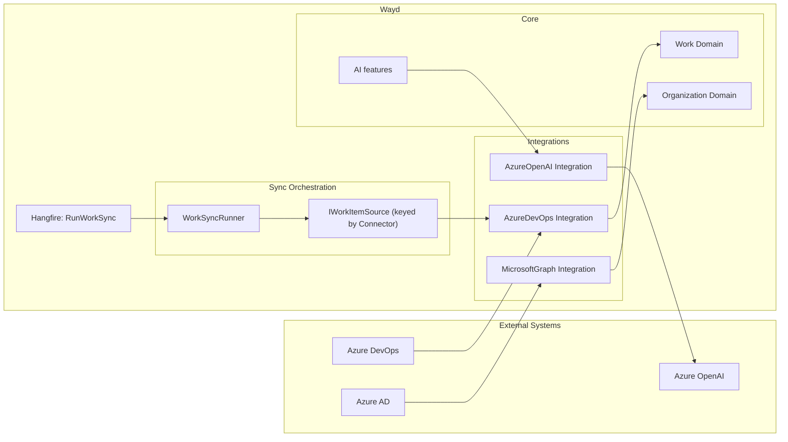

# Integrations

Wayd talks to external systems through two layers:

- **Connectors** are customer-configured at runtime via **Settings → Connections**. Each connection stores its own credentials (encrypted at rest) and runs against the target system on the customer's behalf.
- **Integration libraries** (`Wayd.Integrations.*`) are the low-level clients those connectors use, plus a handful of always-on internal integrations (Microsoft Graph for AAD sync) that aren't surfaced as configurable connectors.

## Connectors

Connectors are managed from **Settings → Connections**. The set of supported connector types is defined in code; adding one is described in the [Architecture guide](../contributing/architecture.mdx#connector-framework).

| Connector | Category | Status | Purpose |
|---|---|---|---|
| Azure DevOps | Work sync | GA | Syncs work items, processes, workspaces, and teams from Azure DevOps into Wayd. |
| Azure OpenAI | AI provider | Preview | Outbound LLM client used by Wayd AI features. No data is synced from this connector. |
| OpenAI | AI provider | Reserved | Backend scaffolding present; no admin UI to create one yet. |

### Credentials are encrypted at rest

Every credential field on a connector (PAT, API key, future OAuth refresh tokens) is marked `[Encrypted]` and round-tripped through AES-256-GCM via the `EncryptingJsonValueConverter` before being written to the `Connections` table. The master key is configured via `SecuritySettings:DataProtection:MasterKey` — see the [Configuration guide](../contributing/configuration.mdx#data-protection-at-rest-secret-encryption) for setup and the [key rotation caveat](../contributing/configuration.mdx#data-protection-at-rest-secret-encryption).

API responses additionally mask secret fields before returning them, so a leaked API response never exposes the raw credential.

## Azure DevOps

`Wayd.Integrations.AzureDevOps` provides one-way work item synchronization from Azure DevOps into Wayd.

### Capabilities

- Sync work items from Azure DevOps projects into Wayd workspaces
- Map Azure DevOps work item types to Wayd work types
- Maintain ownership tracking (Managed items are read-only in Wayd)
- Background synchronization via Hangfire jobs

### How It Works

1. An admin creates an **Azure DevOps Connection** in Settings → Connections, supplying organization name and a PAT
2. Wayd validates the PAT, persists the connection (PAT encrypted at rest), and fetches the org's work processes and projects
3. Each Azure DevOps project is initialized into a Wayd **Workspace**; each work process into a Wayd **Work Process**
4. Hangfire **recurring jobs** sync work items on a schedule once sync is enabled
5. Synced items have **Managed** ownership and are read-only in Wayd

## Azure OpenAI

`Wayd.Integrations.AzureOpenAI` is an outbound LLM client; it does not sync data into Wayd.

A connection stores the resource base URL, deployment name, and API key (encrypted at rest). Wayd features that need LLM access — currently limited; broader AI surface is roadmap — pick up the active Azure OpenAI connection at request time.

## Microsoft Graph

`Wayd.Integrations.MicrosoftGraph` synchronizes employee and user data from Azure Active Directory. Unlike the other integrations above, Microsoft Graph is **not** surfaced as a configurable connector — it runs automatically when Entra authentication is enabled, reusing the API app registration's credentials.

### Capabilities

- Import employees from Azure AD
- Keep employee information up to date
- Map AD users to Wayd employees

## Integration Architecture

## Adding a New Connector

For sync-shaped or AI-provider connectors that customers configure in Settings → Connections:

1. Add the connector type to `Connector` enum in `Wayd.Common.Domain.Enums.AppIntegrations`
2. Create a domain configuration class (e.g. `JiraConnectionConfiguration`) and connection aggregate (`JiraConnection : Connection<JiraConnectionConfiguration>`). For sync-shaped connectors, also implement `ISyncableConnection`. Mark credential fields with `[Encrypted]` for at-rest encryption — see [Architecture → Connector framework](../contributing/architecture.mdx#connector-framework)
3. Create command/query handlers under `Wayd.AppIntegration.Application/Connections/Commands/\{Connector\}/` following the AzDO and AOAI templates
4. Register the EF entity configuration in `AppIntegrationConfiguration.cs` and add a migration
5. Add a `Wayd.Integrations.\{SystemName\}` project for the low-level client (only if the connector actually talks to a remote system — pure AI providers can use an existing SDK directly)
6. **For work-sync connectors only:** implement `IWorkItemSource` (in `Wayd.AppIntegration.Application/Connections/Managers/\{Connector\}WorkItemSource.cs`) and register it keyed by your `Connector` enum value: `services.AddKeyedTransient<IWorkItemSource, JiraWorkItemSource>(Connector.Jira)`. The generic `WorkSyncRunner` picks it up automatically — **do not** add a per-connector Hangfire job. See [Architecture → Sync orchestration](../contributing/architecture.mdx#sync-orchestration).
7. On the frontend, register the connector in `_components/connector-registry.ts` (create form) and `[id]/_components/detail-registry.tsx` (detail page) — see [Architecture → Connector framework](../contributing/architecture.mdx#connector-framework)

For always-on internal integrations (like Microsoft Graph) that aren't surfaced as connectors, skip steps 1–4, 6, and 7 — those are just classes called directly from feature code.
