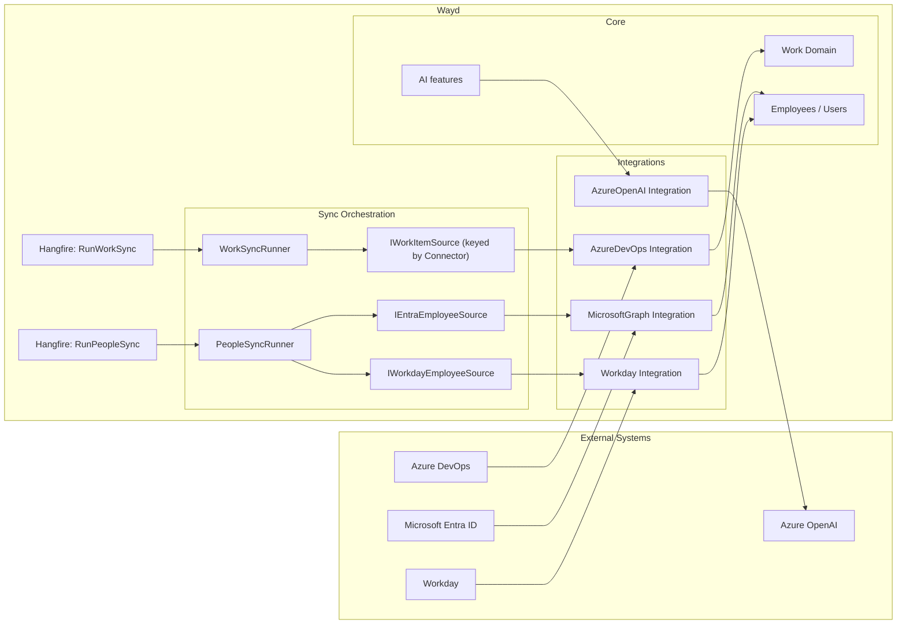

# Integrations

Wayd talks to external systems through two layers:

- **Connectors** are customer-configured at runtime via **Settings → Connections**. Each connection stores its own credentials (encrypted at rest) and runs against the target system on the customer's behalf.
- **Integration libraries** (`Wayd.Integrations.*`) are the low-level clients those connectors use. There are no longer any always-on, configuration-driven integrations — every external system Wayd pulls data from is a connector you create in the UI.

## Connectors

Connectors are managed from **Settings → Connections**. The set of supported connector types is defined in code; adding one is described in the [Architecture guide](../contributing/architecture.mdx#connector-framework).

| Connector | Category | Status | Purpose |
|---|---|---|---|
| Azure DevOps | Work sync | GA | Syncs work items, processes, workspaces, and teams from Azure DevOps into Wayd. |
| Entra | People sync | GA | Syncs people (employees, contingent workers) from Microsoft Entra ID via Microsoft Graph into Wayd's `Employee` records. |
| Workday | People sync | GA | Syncs workers (employees, contingent workers) from a Workday tenant via the Staffing v46.1 SOAP web service into Wayd's `Employee` records. |
| Azure OpenAI | AI provider | Preview | Outbound LLM client used by Wayd AI features. No data is synced from this connector. |
| OpenAI | AI provider | Reserved | Backend scaffolding present; no admin UI to create one yet. |

### Categories drive orchestration

Each connector belongs to a `ConnectorCategory`. The category — not the specific connector type — determines which background runner picks the connection up:

- **Work Sync** → `WorkSyncRunner` (Hangfire job `WorkFullSync` / `WorkDiffSync`).
- **People Sync** → `PeopleSyncRunner` (Hangfire job `PeopleSync`).
- **AI Provider** → not synced; consumed on demand by features that need LLM access.

The detail page's **Sync Now** action and **Sync History** tab dispatch by category too, so a future Workday (or BambooHR, Okta, etc.) connector just declares `ConnectorCategory.PeopleSync` and gets the same plumbing for free.

### Credentials are encrypted at rest

Every credential field on a connector (PAT, API key, client secret, future OAuth refresh tokens) is marked `[Encrypted]` and round-tripped through AES-256-GCM via the `EncryptingJsonValueConverter` before being written to the `Connections` table. The master key is configured via `SecuritySettings:DataProtection:MasterKey` — see the [Configuration guide](../contributing/configuration.mdx#data-protection-at-rest-secret-encryption) for setup and the [key rotation caveat](../contributing/configuration.mdx#data-protection-at-rest-secret-encryption).

API responses additionally mask secret fields before returning them, preserving the first 4 characters and the original length so the edit form can detect "the user posted back the masked value unchanged" without ever exposing the full secret over the wire.

### Activation

New connections are **active by default**. Admins toggle this from the detail page's action menu — `IsActive` is the single switch that controls whether a connection participates in sync runs (no separate "sync enabled" flag; the two concepts were collapsed since `IsActive=false` already excludes a connection from every runner). Activation transitions raise `EntityActivatedEvent` / `EntityDeactivatedEvent` so the deliberate state change is captured in domain events rather than silently bundled into a config edit.

## Azure DevOps

`Wayd.Integrations.AzureDevOps` provides one-way work item synchronization from Azure DevOps into Wayd.

### Capabilities

- Sync work items from Azure DevOps projects into Wayd workspaces
- Map Azure DevOps work item types to Wayd work types
- Maintain ownership tracking (Managed items are read-only in Wayd)
- Background synchronization via Hangfire jobs

### How It Works

1. An admin creates an **Azure DevOps Connection** in Settings → Connections, supplying organization name and a PAT
2. Wayd validates the PAT, persists the connection (PAT encrypted at rest), and fetches the org's work processes and projects
3. Each Azure DevOps project is initialized into a Wayd **Workspace**; each work process into a Wayd **Work Process**
4. Hangfire **recurring jobs** sync work items on a schedule once sync is enabled
5. Synced items have **Managed** ownership and are read-only in Wayd

## Entra (Microsoft Graph)

`Wayd.Integrations.MicrosoftGraph` synchronizes people (employees and contingent workers) from Microsoft Entra ID into Wayd's `Employee` table. Each Entra connection talks to a single Entra tenant; multiple connections per deployment are supported (e.g. one per acquired company's tenant).

### Capabilities

- Pull users from a single Entra tenant via Microsoft Graph
- Optionally scope to a single Entra group (transitive members) instead of all member users
- Optionally include disabled accounts
- Admin-selectable "Normalize Name Casing" — title-cases names that come back from Entra in all-caps, handling Mc/Mac, apostrophes (O', D'), and hyphenated names correctly. Mixed-case input is preserved. Default on
- Upsert into Wayd `Employee` records, preserving manager hierarchy
- Deactivate Wayd employees not present in the latest payload

### How It Works

1. An admin creates an **Entra Connection** in Settings → Connections, supplying tenant ID, client ID, client secret (encrypted at rest), and optionally a group object ID
2. The `PeopleSyncRunner` reads all active `ConnectorCategory.PeopleSync` connections and, for each, builds a per-connection `GraphServiceClient` from the stored credentials — there is no shared app-wide Graph client for sync
3. The `MicrosoftGraphService` source pulls users (paginated), filters out accounts missing `givenName`/`surname`, and returns `EntraEmployee` records
4. The existing connector-agnostic `BulkUpsertEmployeesCommand` reconciles those records against the `Employee` table; employees not in the payload are deactivated
5. Each run is captured as a `SyncRun` row; per-run details (`employeesFetched`, `employeesUpserted`, `errors[]`) are stored as JSON and rendered in the Sync History tab

The Entra connection (tenant ID, client ID, client secret) is created and managed by admins in **Settings → Connections**; its credentials are stored on the connection row, encrypted at rest. There is no configuration-file or environment-variable path for the connector.

## Workday

`Wayd.Integrations.Workday` synchronizes workers (employees and contingent workers) from a Workday tenant into Wayd's `Employee` table via the [Staffing v46.1 SOAP web service](https://community.workday.com/sites/default/files/file-hosting/productionapi/Staffing/v46.1/Staffing.html). Each Workday connection talks to a single tenant; multiple connections per deployment are supported but only one People-sync connection may be **active** at a time across all PeopleSync connectors.

### Capabilities

- Pull workers from a Workday tenant via `Get_Workers` (Staffing v46.1)
- Optionally include terminated/inactive workers
- Automatic incremental sync via `Transaction_Log_Criteria` after the first successful run (no admin toggle — the runner uses the prior successful run's timestamp as the watermark; first run is always a full snapshot)
- Admin-selectable upsert key: Workday `Employee_ID` (default, human-readable) or `WID` (immutable internal)
- Admin-selectable `MatchBy` (Email or EmployeeNumber) for cross-source identity continuity
- Admin-selectable "Use Preferred Name" — reads `Preferred_Name_Data` in preference to `Legal_Name_Data`, falling back to legal per-component when a preferred component is missing. Default off
- Admin-selectable "Normalize Name Casing" — title-cases names that come back from Workday in all-caps (HRIS compliance convention), handling Mc/Mac inner-capitals, apostrophes (O', D'), hyphens, and Unicode characters correctly. Mixed-case input is preserved untouched. Default on
- Admin-selectable "Department Source (Organization_Type_ID)" — controls which Workday org-type drives `Employee.Department`. The init probe calls `Get_Organizations` and persists the discovered catalog so admins can pick `SUPERVISORY` (default — Workday's universal reporting hierarchy), `COST_CENTER`, `BUSINESS_UNIT`, a tenant-custom type, or leave blank to skip Department sync. Changing this setting takes effect on the next sync; admins can click "Full Sync" to immediately re-project existing employees with the new mapping
- Init "probe" on save / "Test Connection" that detects ISU permission gaps before sync runs
- Upsert into Wayd `Employee` records, preserving manager hierarchy from `Management_Chain_Data`

### How It Works

1. An admin creates a **Workday Connection** in Settings → Connections, supplying the Staffing service WSDL URL plus the Integration System User (ISU) username + password (encrypted at rest)
2. The create handler runs an **init probe** — a small `Get_Workers` request (10 workers) — and persists a structured result on the connection (missing required fields, warnings, auth error). `IsValidConfiguration` is driven by this probe; sync is disabled until it passes
3. The `PeopleSyncRunner` reads all active `ConnectorCategory.PeopleSync` connections and dispatches Workday connections through `IWorkdayEmployeeSource`
4. `WorkdayStaffingService` pages through `Get_Workers` (100/page) with response groups `Include_Reference`, `Include_Personal_Information`, `Include_Employment_Information`, `Include_Organizations`, and `Include_Management_Chain_Data`. Each worker projects into a `WorkdayEmployee` record
5. The connector-agnostic `BulkUpsertEmployeesCommand` reconciles those records against the `Employee` table using the configured `MatchBy` property; employees not in the payload are deactivated
6. Each run is captured as a `SyncRun` row; sync history is rendered in the connection detail page's Sync History tab

The connection (WSDL URL, ISU username, ISU password) is created and managed by admins in **Settings → Connections**; credentials are stored on the connection row, encrypted at rest. There is no configuration-file or environment-variable path for the connector.

### ISU permissions (Integration System Security Group)

The probe and the sync both rely on the ISU being a member of a Workday Integration System Security Group (ISSG) that has **Get/View** access to the data domains below. Workday returns elements selectively based on ISSG grants — a domain that's not granted causes its element to be **omitted from the response entirely**, which the probe surfaces as a missing required field. Hand this list to the customer's Workday administrator when provisioning the ISU:

| Workday domain (Get/View) | What Wayd reads | Required? |
|---|---|---|
| **Worker Data: Public Worker Reports** | `Worker_Reference` (WID, Employee_ID), `Personal_Data/Name_Data`, `Worker_Status_Data` | Required |
| **Worker Data: Personal Contact Information** | `Personal_Data/Contact_Data/Email_Address_Data` (work email) | Required (or enable the User_ID fallback — see below) |
| **Worker Data: Current Staffing Information** | `Employment_Data/Worker_Job_Data/Position_Data` (job title, position, hire date, business site) | Required |
| **Worker Data: Organization Information** | `Organization_Data` and `Position_Organizations_Data` (Department, Cost Center, Company) | Recommended — drives the Department field |
| **Worker Data: Management Chain** | `Management_Chain_Data/Worker_Supervisory_Management_Chain_Data` | Recommended — drives manager hierarchy |

Domain names vary very slightly across Workday tenants (release-trains rename them occasionally). If the probe reports "Work Email" missing, the most likely cause is **Worker Data: Personal Contact Information** not being granted to the ISU's ISSG. Have the Workday admin run **View Security for Securable Item** → search the domain → confirm the ISU's ISSG is listed under the Get/View grants. After granting, run **Activate Pending Security Policy Changes** to apply.

#### Use User_ID as Email Fallback

Some tenants (especially implementer sandboxes, OR customers who deliberately scope ISU grants narrowly) won't grant **Worker Data: Personal Contact Information**. For those cases, the connection has a **Use User_ID as Email Fallback** toggle:

- **Off (default)**: Sync uses `Personal_Data/Contact_Data/Email_Address_Data` only. If a worker has no work email element in the response, that worker is skipped.
- **On**: When `Contact_Data` is missing or empty, the sync uses `Worker_Data/User_ID` (the Workday account login) **only if it parses as a valid email address**. Workers whose `User_ID` is a non-email username (e.g. `EMP-1234`) are still skipped.

`User_ID` is exposed by the base **Worker Data: Public Worker Reports** domain, which the ISU already needs, so enabling the fallback doesn't require additional grants. This is a pragmatic workaround for tenants where the username happens to be the user's work email; prefer granting the proper domain in production where possible.

### Versioning

The customer's tenant version is encoded in the WSDL URL path (e.g. `…/Staffing/v46.1`) and stored on the connection. The runtime sends a consistent request shape regardless — Workday's WWS is forward+backward compatible across versions for read operations. Field paths live in `WorkerFieldPaths.cs` and support multi-candidate XPaths, so a Workday major-version field rename can be absorbed by adding a fallback XPath without a code restructure. The sync logs a warning when a previously-populated field comes back null on more than 50% of workers in a run, as a signal that Workday changed something.

## Azure OpenAI

`Wayd.Integrations.AzureOpenAI` is an outbound LLM client; it does not sync data into Wayd.

A connection stores the resource base URL, deployment name, and API key (encrypted at rest). Wayd features that need LLM access — currently limited; broader AI surface is roadmap — pick up the active Azure OpenAI connection at request time.

## Integration Architecture

## Adding a New Connector

For sync-shaped or AI-provider connectors that customers configure in Settings → Connections:

1. Add the connector type to `Connector` enum in `Wayd.Common.Domain.Enums.AppIntegrations`
2. Map it to a `ConnectorCategory` in `ConnectorExtensions.GetCategory()` — the category determines which runner picks it up (work-sync, people-sync, AI-provider)
3. Create a domain configuration class (e.g. `JiraConnectionConfiguration`) and connection aggregate (`JiraConnection : Connection<JiraConnectionConfiguration>`). For sync-shaped connectors that have per-target integration state (workspaces, projects), also implement `ISyncableConnection`. Mark credential fields with `[Encrypted]` for at-rest encryption — see [Architecture → Connector framework](../contributing/architecture.mdx#connector-framework)
4. Create command/query handlers under `Wayd.AppIntegration.Application/Connections/Commands/\{Connector\}/` following the AzDO, Entra, and AOAI templates
5. Register the EF entity configuration in `AppIntegrationConfiguration.cs` and add a migration (the migration is typically a no-op when the connector reuses the shared `Connections` TPH table — it just adds a discriminator value)
6. Add a `Wayd.Integrations.\{SystemName\}` project for the low-level client (only if the connector actually talks to a remote system — pure AI providers can use an existing SDK directly)
7. **For work-sync connectors:** implement `IWorkItemSource` (in `Wayd.AppIntegration.Application/Connections/Managers/\{Connector\}WorkItemSource.cs`) and register it keyed by your `Connector` enum value: `services.AddKeyedTransient<IWorkItemSource, JiraWorkItemSource>(Connector.Jira)`. The generic `WorkSyncRunner` picks it up automatically.
8. **For people-sync connectors:** today the `PeopleSyncRunner` routes by `Connector` enum value inside its `FetchEmployees` switch. Add a new arm and a corresponding fetch method that loads the connection's credentials and calls your source. (A future refactor will factor people sources behind an `IPeopleSourceFactory` mirroring the work-sync factory; until then this single switch is the seam.)
9. On the frontend, register the connector in `_components/connector-registry.ts` (create/edit form), `[id]/_components/detail-registry.tsx` (detail page), and `types/connectors.ts` (enum + display names). See [Architecture → Connector framework](../contributing/architecture.mdx#connector-framework) for the full checklist.
