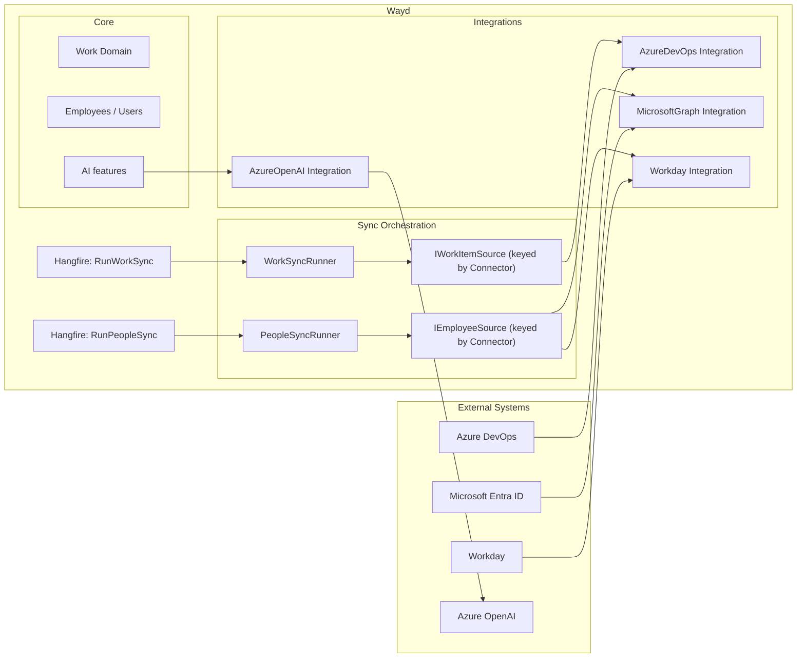

# Integrations

Wayd talks to external systems through two layers:

- **Connectors** are customer-configured at runtime via **Settings → Connections**. Each connection stores its own credentials (encrypted at rest) and runs against the target system on the customer's behalf.
- **Integration libraries** (`Wayd.Integrations.*`) are the low-level clients those connectors use. There are no longer any always-on, configuration-driven integrations — every external system Wayd pulls data from is a connector you create in the UI.

## Connectors

Connectors are managed from **Settings → Connections**. The set of supported connector types is defined in code; adding one is described in the [Architecture guide](../../contributing/architecture.mdx#connector-framework).

| Connector | Category | Status | Purpose |
|---|---|---|---|
| [Azure DevOps](./azure-devops.mdx) | Work sync | GA | Syncs work items, processes, workspaces, and teams from Azure DevOps into Wayd. |
| [Entra](./entra.mdx) | People sync | GA | Syncs people (employees, contingent workers) from Microsoft Entra ID via Microsoft Graph into Wayd's `Employee` records. |
| [Workday](./workday.mdx) | People sync | GA | Syncs workers (employees, contingent workers) from a Workday tenant via the Staffing v46.1 SOAP web service into Wayd's `Employee` records. |
| [Azure OpenAI](./azure-openai.mdx) | AI provider | Preview | Outbound LLM client used by Wayd AI features. No data is synced from this connector. |
| OpenAI | AI provider | Reserved | Backend scaffolding present; no admin UI to create one yet. |

## Cross-cutting concerns

These behaviors apply to every connector — the per-connector pages link back here rather than repeat them.

### Capabilities drive orchestration

Each connector declares the `ConnectorCapability` values it supports (a multi-surface connector like GitHub can support several through one connection). The capability — not the specific connector type — determines which background runner picks the connection up:

- **Work Sync** → `WorkSyncRunner` (Hangfire job `WorkFullSync` / `WorkDiffSync`).
- **People Sync** → `PeopleSyncRunner` (Hangfire jobs `PeopleFullSync` / `PeopleDiffSync`). Connectors that don't support incremental fall back to Full transparently.
- **AI Provider** → not synced; consumed on demand by features that need LLM access.

The detail page's **Sync Now** action and **Sync History** tab dispatch by capability too, so a future BambooHR / Okta / Jira connector just declares the right `ConnectorCapability` values and gets the same plumbing for free. Each capability also carries a display category (the enum's `Display(GroupName)`, e.g. "Work Management") that groups the connector picker.

### Only one People Sync connection may be active at a time

Across all PeopleSync connectors (Entra, Workday, future BambooHR/etc.), at most one connection can be `IsActive=true` simultaneously. Activating a second active People Sync connection while one is already active is rejected by `ActivateConnectionCommand` with a clear message. This is a guardrail against the same person becoming two `Employee` rows.

Multiple People Sync connections may *exist* — admins can stage one, configure it fully, and only flip the active flag during the cutover. The single-active rule applies only at activation time.

Work Sync has no equivalent limit; multiple Azure DevOps / future Jira connections can be active concurrently.

### Credentials are encrypted at rest

Every credential field on a connector (PAT, API key, client secret, ISU password, future OAuth refresh tokens) is marked `[Encrypted]` and round-tripped through AES-256-GCM via the `EncryptingJsonValueConverter` before being written to the `Connections` table. The master key is configured via `SecuritySettings:DataProtection:MasterKey` — see the [Configuration guide](../../contributing/configuration.mdx#data-protection-at-rest-secret-encryption) for setup and the [key rotation caveat](../../contributing/configuration.mdx#data-protection-at-rest-secret-encryption).

API responses additionally mask secret fields before returning them, preserving the first 4 characters and the original length so the edit form can detect "the user posted back the masked value unchanged" without ever exposing the full secret over the wire.

### Activation

New connections are **active by default**. Admins toggle this from the detail page's action menu — `IsActive` is the single switch that controls whether a connection participates in sync runs (no separate "sync enabled" flag; the two concepts were collapsed since `IsActive=false` already excludes a connection from every runner). Activation transitions raise `EntityActivatedEvent` / `EntityDeactivatedEvent` so the deliberate state change is captured in domain events rather than silently bundled into a config edit.

### Sync history

Every sync run — manual or scheduled, per-connection or global — produces a `SyncRun` row with status, timestamps, and a per-run `DetailsJson` blob. The Sync History tab on each connection's detail page renders this JSON with a connector-aware schema (e.g. People sync shows `employeesFetched` / `employeesUpserted` / `employeesExcluded`; Work sync shows per-workspace work-item counts).

## Integration Architecture

## Adding a New Connector

For sync-shaped or AI-provider connectors that customers configure in Settings → Connections:

1. Add the connector type to `Connector` enum in `Wayd.Common.Domain.Enums.AppIntegrations`
2. Declare its `ConnectorCapability` values in `ConnectorExtensions.GetCapabilities()` — the capabilities determine which runners pick it up (work-sync, people-sync, AI-provider); a multi-surface connector declares several
3. Create a domain configuration class (e.g. `JiraConnectionConfiguration`) and connection aggregate (`JiraConnection : Connection<JiraConnectionConfiguration>`). For sync-shaped connectors that have per-target integration state (workspaces, projects), also implement `ISyncableConnection`. Mark credential fields with `[Encrypted]` for at-rest encryption — see [Architecture → Connector framework](../../contributing/architecture.mdx#connector-framework)
4. Create command/query handlers under `Wayd.AppIntegration.Application/Connections/Commands/{Connector}/` following the AzDO, Entra, and AOAI templates
5. Register the EF entity configuration in `AppIntegrationConfiguration.cs` and add a migration (the migration is typically a no-op when the connector reuses the shared `Connections` TPH table — it just adds a discriminator value)
6. Add a `Wayd.Integrations.{SystemName}` project for the low-level client (only if the connector actually talks to a remote system — pure AI providers can use an existing SDK directly)
7. **For work-sync connectors:** implement `IWorkItemSource` (in `Wayd.AppIntegration.Application/Connections/Managers/{Connector}WorkItemSource.cs`). The generic `WorkSyncRunner` picks up every registered source automatically.
8. **For people-sync connectors:** implement `IEmployeeSource` (an adapter in `Wayd.AppIntegration.Application/Connections/Managers/{Connector}EmployeeSource.cs` wrapping your low-level service) and an `ISyncableConnectionDescriptorBuilder`. Declare `SupportsIncremental` and `MatchBy` on the source. The generic `PeopleSyncRunner` picks it up automatically — no runner edits.
9. **Add the connector's module:** one `IConnectorModule` class in `Wayd.Infrastructure/ConnectorModules/` declaring the connector's capabilities and registering everything from steps 6–8 (keyed sources, descriptor builder, optional `IConnectionInitProbe`, HTTP clients). Modules are assembly-scanned at startup; architecture tests fail CI if the module is missing, its capabilities disagree with `GetCapabilities()`, or a declared sync capability lacks its keyed source.
10. On the frontend, register the connector in `_components/connector-registry.ts` (create/edit form), `[id]/_components/detail-registry.tsx` (detail page), and `types/connectors.ts` (enum + display names). See [Architecture → Connector framework](../../contributing/architecture.mdx#connector-framework) for the full checklist.
