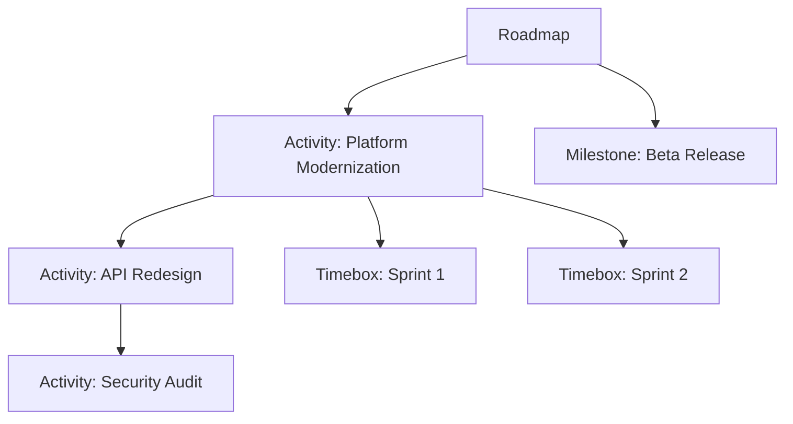

# Roadmaps

**Roadmaps** provide a visual timeline for planning and communicating work across time periods. They support hierarchical items and access-controlled editing.

Every roadmap has:
- **Name** and optional **Description**
- **Date Range** — The time period the roadmap covers
- **Visibility** — Public (visible to all users) or Private (visible to managers only)
- **Managers** — Users with edit access (at least one required)
- **Items** — The content of the roadmap

## Roadmap Items

Roadmaps contain three types of items, which can be nested hierarchically:

- **Activity** — A deliverable or initiative with a date range. Activities can contain child items (other activities, milestones, or timeboxes), enabling a hierarchical work breakdown.
- **Milestone** — A point-in-time marker representing a key date or achievement.
- **Timebox** — A time-bounded period (e.g., a sprint or phase).

All items support an optional **Color** property for visual differentiation. When a roadmap has a [color palette](#roadmap-colors) configured, activities are colored by choosing from those named colors; otherwise any color can be picked freely.

## Roadmap Detail Page

The roadmap detail page offers two views:

**Timeline View** (default) — Visual timeline showing activities, milestones, and timeboxes. Managers can drag and drop items to reorder them.

**List View** — Hierarchical tree grid showing all items with Name, Type, Start Date, End Date, and Status. Supports inline editing for managers and keyboard shortcuts.

Clicking an item opens a **drawer** with full details, edit, and delete actions.

**Actions (for managers):**
- Edit Roadmap (name, description, dates, visibility, managers)
- Configure Colors (define the roadmap's named color palette — see [Roadmap Colors](#roadmap-colors))
- Create Activity, Create Timebox
- Copy Roadmap (creates a deep copy with new name and managers)
- Delete Roadmap

Roadmaps can be **copied** to create new versions, preserving the full hierarchy of items.

## Roadmap Colors

By default, activity colors are picked freely and mean whatever each person intends — which makes it hard to read a roadmap at a glance. To give colors a shared meaning, managers can define a **color palette** for the roadmap: an ordered list of named colors (for example, *Platform Team*, *At Risk*, *Customer Commitment*).

Open **Actions → Configure Colors** to manage the palette:

- **Add a color** — pick a color and give it a caption describing what it represents.
- **Reorder** — drag colors to change the order they appear in the picker and the legend.
- **Set a default** — mark one color (★) as the default. Activities that have no color of their own are shown in this color.
- **Remove** — delete a color from the palette.

Each color must have a caption, and a color can only be used once per roadmap.

### How the palette is used

Once a palette is configured:

- **Activity colors** are chosen from the palette's named colors instead of a free color picker. Leaving an activity's color empty lets it fall back to the roadmap's default color.
- A **legend** appears beneath the timeline, showing each color and its caption so viewers can interpret the roadmap at a glance.

The default color is applied when the timeline is displayed — it is not written onto the activities. Changing the default (or any color in the palette) instantly updates every activity that relies on it, with no need to edit items individually.

:::note
Color palettes apply to **activities**. Milestones and timeboxes still use their own colors. If a roadmap has no palette configured, activities use the standard free color picker and no legend is shown.
:::

## Timeline Controls

The timeline view includes a toolbar with controls for navigation, zoom, and display settings.

### Navigation

| Control | Action |
|---------|--------|
| Click + drag on empty space | Pan the timeline |
| Scroll wheel | Pan vertically |
| Shift + scroll | Pan horizontally |
| Ctrl/Cmd + scroll | Zoom in / out |
| **+** / **−** buttons | Zoom in / out (toolbar) |
| Reset view button | Return to the default window and zoom |

### Zoom

The timeline starts with the roadmap's date range filling the viewport. Zoom in for day-level detail or zoom out to see the full domain (earliest item start to latest item end). The reset view button always returns to the original window.

### Editing Items (managers only)

| Control | Action |
|---------|--------|
| Drag bar | Move the item |
| Drag left/right handle | Resize start or end date |
| Esc during drag | Cancel the drag without saving |

### Settings Menu

Click the **gear icon** to toggle display options:

- **Show Current Time** — Red vertical line marking today
- **Show Vertical Gridlines** — Gridlines aligned to the current zoom unit (month, week, or day)
- **Highlight Weekends** — Shaded columns for Saturday and Sunday (visible at week/day zoom)
- **Compact Mode** — Reduces row height to fit more items without scrolling

### Help

Click the **? icon** to see a summary of keyboard and mouse controls.

## Common Tasks

### Creating a Roadmap

1. Navigate to **Planning > Roadmaps**
2. Click **Create Roadmap**
3. Enter **Name**, **Date Range**, and **Visibility**
4. Add yourself as a **Manager**
5. Add **Activities**, **Milestones**, and **Timeboxes** to populate the timeline
