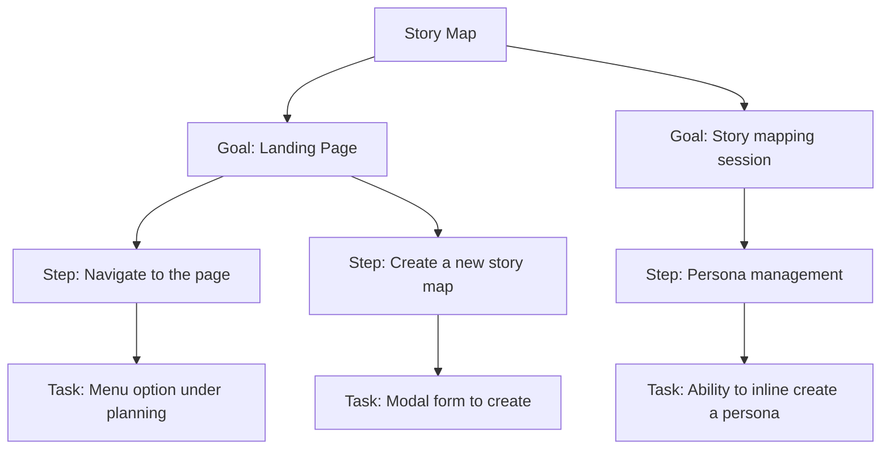

# Story Maps

> This feature is behind the `story-maps` feature flag. See [Feature Flags](../settings/index.mdx#feature-management) for details.

**Story Maps** lay out a product's user journey as a grid so a team can see the whole experience at once, then slice it into releases. Instead of a flat backlog, work is arranged along the path a user actually takes — left to right in the order things happen, top to bottom in order of priority.

The technique comes from Jeff Patton's *User Story Mapping*. Wayd's board follows the familiar shape: a narrative flow across the top, the detail hanging beneath it, and horizontal bands for slicing that detail into releases.

## The Structure

A story map has four levels, plus personas that cut across them:



- **Goal** — What the user is trying to accomplish. The top row of the board, read left to right as the journey unfolds. Goals are sometimes called activities or backbone items.
- **Step** — A stage within a goal. Each step gets its own column, so the second row reads as the narrative flow across the whole map.
- **Task** — A specific piece of work under a step. Tasks stack vertically inside the grid cell where their step column meets a swim lane row.
- **Swim Lane** — A horizontal band slicing the map into releases, milestones, or phases. Every task sits in exactly one lane.
- **Persona** — Who a step or task is for. Personas are tags, not a level of the hierarchy — see [Personas](#personas).

A goal can have no steps, and a step can have no tasks. Both still hold their place on the board so you can see the gap.

## The Board

The detail page renders the whole map as one aligned grid:

```
┌────────┬───────────────────────────────────────────────┐
│ Goals  │  Landing Page          │ Story mapping session│
├────────┼────────────┬───────────┼──────────┬───────────┤
│ Steps  │ Navigate   │ Create a  │ Persona  │ Story map │
│        │ to the page│ new map   │ mgmt     │ mgmt      │
├────────┼────────────┼───────────┼──────────┼───────────┤
│ Tasks                                        12 tasks  │  ← swim lane
├────────┼────────────┼───────────┼──────────┼───────────┤
│        │ [task]     │ [task]    │ [task]   │ [task]    │
│        │ [task]     │           │ [task]   │           │
├────────┴────────────┴───────────┴──────────┴───────────┤
│ Release 2                                     8 tasks  │  ← swim lane
├────────┬────────────┬───────────┬──────────┬───────────┤
│        │ [task]     │ [task]    │          │ [task]    │
└────────┴────────────┴───────────┴──────────┴───────────┘
```

Every step gets one column, and a goal header spans the columns of its own steps. The label column on the left stays fixed while the board scrolls sideways, so you never lose track of which row you are reading. Columns share the available width evenly and stop shrinking at a minimum, so a wide map scrolls rather than squeezing its cards into unreadable slivers.

Each swim lane is a full-width banner followed by a row of cells. A task's position is the intersection of its step's column and its lane's row.

## Personas

**Personas** identify who a piece of the map is for — *Product Manager*, *Engineer*, *Customer*. They are scoped to a single map: creating a persona on one map does not create it anywhere else.

A persona has a **name**, an optional **description**, and a **color**. Steps and tasks can each be tagged with any number of personas.

### Tagging

Every step and task card has a row of small dots along the bottom, one per persona on the map. A **filled** dot means that persona is linked; a **hollow ring** means it is not. Click a dot to toggle the link. Hovering a dot names the persona.

Goals are not tagged directly — a goal is a container, and it takes its relevance from the steps and tasks beneath it.

### Filtering

The bar above the board filters the map to one persona. Click a persona chip to select it, click it again (or click **All**) to clear.

Filtering **mutes** rather than hides: non-matching steps and tasks fade back, so you can still see the shape of the whole map while the persona's slice stands out. A goal stays lit whenever any step or task beneath it matches.

The counts on the right of the filter bar — goals, steps, tasks — follow the filter, as do the per-lane task counts on each swim lane banner.

### Managing personas

Type a name into **+ Persona** for a quick add; a color is assigned automatically. **Manage** opens a dialog for editing names, descriptions, and colors, reordering personas by drag, and deleting them. Each row shows how many steps and tasks currently use that persona.

Deleting a persona untags it from every step and task on the map. It does not delete any of that work.

## Swim Lanes

Swim lanes slice the map horizontally. The typical use is release planning: everything in the top lane ships first, the next lane ships after that.

Every map starts with one lane named **Tasks**. This default lane is fixed — it cannot be renamed, reordered, or deleted, and it is always first. Every other lane can be renamed, dragged to reorder, and deleted.

Deleting a lane **does not delete its tasks** — they move to the default lane, preserving their relative order. The confirmation tells you how many tasks will move, and a message afterwards confirms it.

Each lane banner shows its task count on the right. This count follows the persona filter; the count in the delete confirmation does not, because every task moves regardless of what is currently on screen.

### Lane dates

A lane can carry an optional **start date**, **end date**, or both. Hover a lane to reveal a calendar icon, then pick the dates.

Both dates are independent and entirely descriptive — nothing is scheduled or validated from them, and a lane with only an end date is perfectly valid. When one date is set it is shown on its own; when both are set they read as a range.

## Editing

Click any goal, step, task, or lane name to edit it in place. **Enter** saves, **Escape** cancels, and clicking away saves. Leaving the field empty keeps the previous name.

Add buttons appear on hover: **+** on a goal cell adds a step, **+** on a step cell adds a task, and **Add swim lane** sits at the bottom of the board. New items are created with a placeholder name and open straight into edit mode, so you can add a goal and type its real name without a second click.

Delete buttons appear on hover in the same places. Deleting a goal deletes its steps and their tasks; deleting a step deletes its tasks. Both warn you first.

## Rearranging

Everything on the board can be dragged. There is no grab handle — drag the card itself. A short drag threshold keeps a plain click free for editing and for the persona dots.

| Item | Can be moved |
|---|---|
| **Goal** | Reordered among goals |
| **Step** | Reordered within its goal, or moved to a different goal |
| **Task** | Reordered within its cell, moved to another step, or moved to another swim lane |
| **Swim Lane** | Reordered, except the default lane, which stays first |

While dragging, a **blue insertion line** shows exactly where the item will land — a vertical line for goals and steps, a horizontal one for tasks. The line sits inside the target's own box rather than on the seam between two items, so the last position in one goal and the first in the next are never ambiguous. An empty cell highlights instead, since it has no card to draw a line against.

Illegal targets never highlight: a step dragged over the goals row shows nothing, because a step cannot become a goal.

To move a step into a goal that has no steps yet, drop it on the empty area beneath that goal.

## Real-time Collaboration

Story maps update live. When several people have the same map open, their avatars appear in the page header, and every change — a renamed step, a dragged task, a new persona — appears for everyone without a refresh. This makes the board usable as the shared artifact during a live story mapping session.

## Exporting

**Actions → Export CSV** downloads the map as a spreadsheet. Anyone who can view the map can export it.

The file has one row per task, with the goal and step repeated on each row:

| Column | Notes |
|---|---|
| Goal | |
| Goal Order | Position on the board, starting at 1 |
| Step | |
| Step Order | Position within its goal |
| Task | |
| Task Order | Position within its cell |
| Description | |
| Personas | Semicolon-separated, e.g. `Engineer; Designer` |
| Swim Lane | |

Rows come out in board order — goal by goal, step by step, lane by lane — so the file reads the same way the board does. Goals with no steps and steps with no tasks still get a row, with the columns below them blank, so the export records the map's full shape.

The export always covers the **whole map**. An active persona filter changes what you see on the board but not what lands in the file.

## Story Map Lifecycle

A story map is **Active** when created. **Actions → Archive** retires it.

Archived maps become read-only — the add, edit, delete, and drag affordances all disappear — and are hidden from the story maps list unless you switch on **Include Archived**. Archiving cannot be undone from the UI.

**Delete** removes a map entirely and is separate from archiving; a map does not need to be archived first.

## Permissions

| Permission | Grants |
|---|---|
| `Permissions.StoryMaps.View` | Open the list and any map; export to CSV |
| `Permissions.StoryMaps.Create` | Create a story map |
| `Permissions.StoryMaps.Update` | Everything on the board — goals, steps, tasks, lanes, personas — plus editing and archiving the map |
| `Permissions.StoryMaps.Delete` | Delete a story map |

Everything a map contains is governed by **Update** on the map itself; there are no separate permissions for goals, steps, tasks, lanes, or personas.

## Common Tasks

### Creating a story map

1. Navigate to **Planning > Story Maps**
2. Click **Create Story Map**
3. Enter a **Name** and optional **Description**
4. Open the new map and click **+ Goal** to start the backbone

### Building the backbone

1. Add the goals for the journey, left to right in the order a user encounters them
2. Under each goal, add the steps that make it up
3. Read the steps row on its own — it should tell the story of the journey end to end

Getting the top two rows right first is worth the time. The backbone is what makes the rest of the map readable.

### Slicing into releases

1. Add a swim lane for each release or milestone
2. Drag tasks up into the earliest lane that must contain them
3. Read across the top lane — that row is your first release, described as a complete journey rather than a list of tickets

### Setting up personas

1. Add a persona per audience using **+ Persona**
2. Tag steps and tasks by clicking the dots on their cards
3. Click a persona chip to see that audience's slice of the journey
