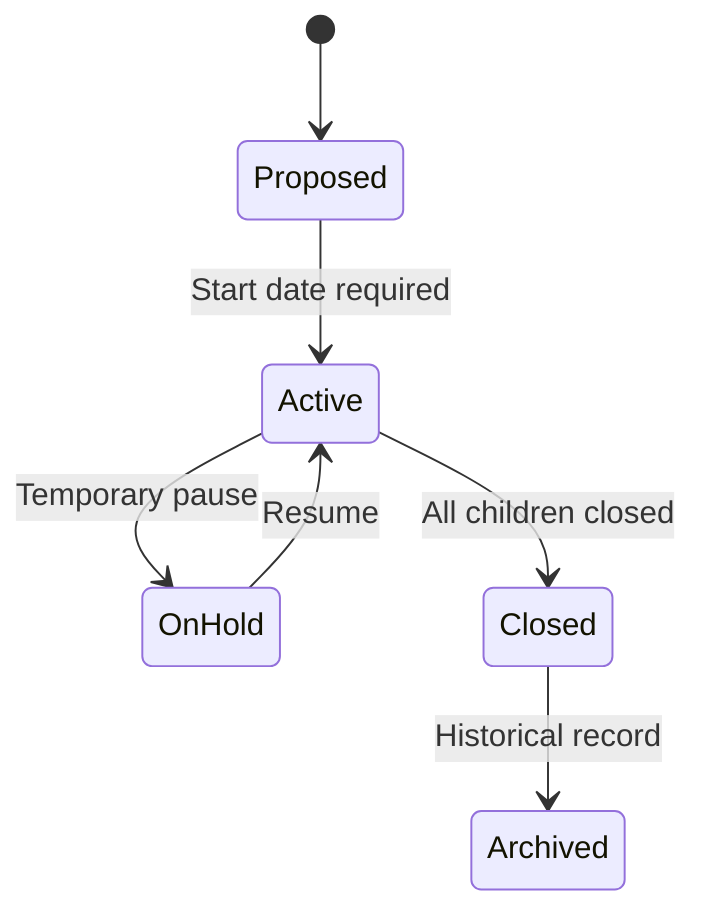

# Portfolios & Programs

## Portfolios

A **Portfolio** is the top-level container for [projects](./projects.mdx), programs, and [strategic initiatives](./strategic-initiatives.mdx). It represents a collection of related work managed together to achieve strategic objectives.

Every portfolio has:
- **Name** and **Description**
- **Status** — Lifecycle state (see [Portfolio Status Lifecycle](#portfolio-status-lifecycle))
- **Date Range** — Start and optional end date
- **Roles** — People assigned to portfolio-level roles
- **Scoring Model** — Optional [active scoring model](../settings/scoring-models.mdx) used to score projects in the portfolio
- **Project Ranking** — Stack-ranked order of projects in the portfolio

Portfolios contain:
- **Programs** — Groups of related [projects](./projects.mdx)
- **[Projects](./projects.mdx)** — Individual initiatives
- **[Strategic Initiatives](./strategic-initiatives.mdx)** — High-level strategic efforts tracked with [KPIs](./strategic-initiatives.mdx#kpis)

### Portfolio Roles

| Role | Description |
|------|-------------|
| Sponsor | Executive sponsor of the portfolio |
| Owner | Person responsible for portfolio outcomes |
| Manager | Manages portfolio execution |
| Portfolio Manager | Oversees portfolio governance |
| Stakeholder Manager | Manages stakeholder relationships |
| Governance Reviewer | Reviews portfolio governance |
| Capacity Planner | Plans resource capacity |

### Portfolio Status Lifecycle

| Status | Description | Date Requirements |
|--------|-------------|-------------------|
| **Proposed** | Early planning stage | None |
| **Active** | Approved and operational | Start date required |
| **On Hold** | Temporarily paused | Start date required |
| **Closed** | All work done | Start and end date required |
| **Archived** | Retired, read-only | Start and end date required |

**Transition rules:**
- All [programs](#programs) and [projects](./projects.mdx) must be closed before closing a portfolio
- Only Proposed portfolios can be deleted
- Archived portfolios are read-only

### Portfolio Project Scoring

A portfolio can be assigned one active [scoring model](../settings/scoring-models.mdx). Assigning a model enables **Priority Score** on every project in the portfolio; clearing the assignment disables new scoring but does not delete existing project score history.

Use **Actions → Set Scoring Model** on the portfolio detail page to assign or clear the model. Only active scoring models can be assigned. If the assigned model is later archived, existing project scores stay intact and users can still see the recorded history.

Project scoring uses immutable snapshots: every recorded score stores the model name, each criterion rating, and every output value at the time it was recorded. This keeps prior scores meaningful even if the portfolio later switches to a different model.

### Portfolio Project Ranking

Every project has a **Rank** within its portfolio. Rank is a human-managed ordering used for prioritization and is independent of the calculated [Priority Score](./projects.mdx#project-priority-scores). A newly created project is placed at the bottom of the portfolio's ranking.

Use the **Ranking** tab on the portfolio detail page to review and adjust the order of Proposed, Approved, and Active projects. The board shows:

- Display position, project name, program, status, dates, project managers, and owners
- Score columns from the portfolio's current scoring model, when one is assigned
- Criterion ratings and output values from each project's current score, but only when that score was recorded with the portfolio's current scoring model
- A score badge on the primary output column, which project managers can use to score or re-score a project

Portfolio Owners and Managers can drag one or more projects to reorder them. Dragging is available only when the board is in its natural rank order; clear sorting, filters, and search to enable ranking. Completed and Cancelled projects are not shown on the Ranking tab, but they keep their underlying rank so historical order remains stable.

Wayd stores ranks as fractional sort keys so drag-and-drop can insert projects between existing rows without renumbering the whole portfolio every time. The **Portfolio Rank Rebalance** background job periodically re-spaces dense ranks back to clean whole-number gaps.

### Portfolio Detail Page

The portfolio detail page has five tabs:

**Details Tab** — Shows sponsors, owners, managers (sorted alphabetically), scoring model, description (Markdown), and links to related entities.

**Programs Tab** — Grid of [programs](#programs) with Key, Name, Status, Start/End dates, Managers, Owners, Sponsors, and [Strategic Themes](../strategic-management/index.mdx#strategic-themes). Supports List and Timeline views. Filtered to show Active programs by default.

**Projects Tab** — Grid of [projects](./projects.mdx) with Key, Name, Status, Portfolio, Program, Start/End dates, Managers, Owners, Sponsors, Strategic Themes, Lifecycle, and Rank. Supports **Card**, **List**, and **Timeline** views. Card view can sort by name or rank. Filtered to show Approved and Active projects by default. The Timeline view groups projects by program.

**Ranking Tab** — Rank-ordered board for Proposed, Approved, and Active projects. Supports drag-to-rank for portfolio Owners/Managers and includes score breakdown columns when a scoring model is assigned.

**Strategic Initiatives Tab** — Grid of [strategic initiatives](./strategic-initiatives.mdx) with Key, Name, Status, Start/End dates, Managers, Owners, Sponsors, and Strategic Themes. Supports List and Timeline views. Filtered to show Approved and Active by default.

## Programs

A **Program** groups related [projects](./projects.mdx) within a portfolio for coordinated management.

Every program has:
- **Name** and **Description**
- **Status** — Proposed, Active, Completed, or Cancelled
- **Date Range** — Start and optional end date
- **Roles** — Sponsor, Owner, Manager
- **Strategic Theme Tags** — Links to [strategic themes](../strategic-management/index.mdx#strategic-themes) for alignment

**Business rules:**
- Only active programs accept new [projects](./projects.mdx)
- All projects must be completed or cancelled before completing a program
- Only Proposed programs can be deleted
- Active status requires a date range

### Program Detail Page

The program detail page uses a two-column layout:

**Left sidebar** — Portfolio link, date range, timeline progress bar, sponsors/owners/managers, [strategic themes](../strategic-management/index.mdx#strategic-themes), description (Markdown), and links.

**Right content area** — Badge showing project count, with project cards that can be expanded or clicked to open a project drawer.

A warning alert appears if dates are missing: *"Program Dates are required before activating."*

## Common Tasks

### Creating a Portfolio

1. Navigate to **PPM > Portfolios**
2. Click **Create Portfolio**
3. Enter **Name** and **Description**
4. The portfolio is created in **Proposed** status
5. **Activate** the portfolio (requires a start date)

### Enabling Project Scoring

1. Create and activate a scoring model in **Settings → Scoring → Scoring Models**.
2. Open the portfolio detail page.
3. Select **Actions → Set Scoring Model**.
4. Choose the active model and click **Save**.
5. Open a project in the portfolio and use its **Priority Score** panel to record the first score.

### Ranking Projects

1. Open the portfolio detail page.
2. Select the **Ranking** tab.
3. Clear any sorting, filters, or search terms.
4. Drag one or more projects to the desired position.
5. Review the **Rank** column in list views, or sort card view by rank, to see the updated order.
