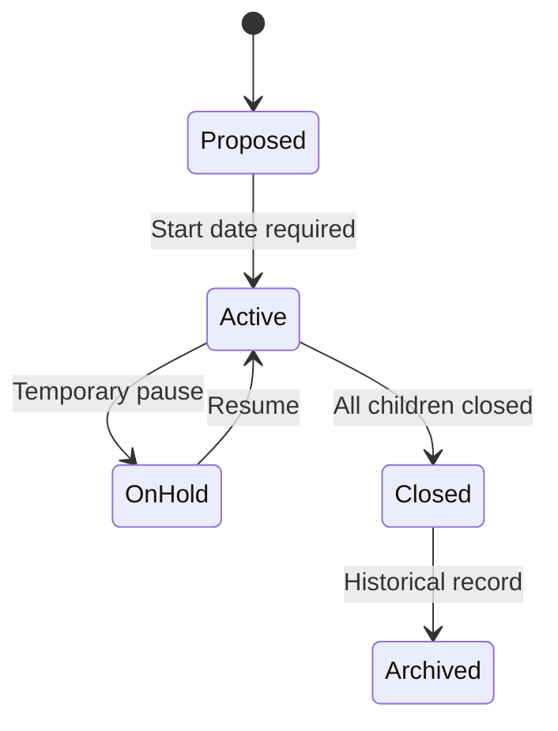

# Portfolios & Programs

## Portfolios

A **Portfolio** is the top-level container for [projects](./projects.mdx), programs, and [strategic initiatives](./strategic-initiatives.mdx). It represents a collection of related work managed together to achieve strategic objectives.

Every portfolio has:
- **Name** and **Description**
- **Status** — Lifecycle state (see [Portfolio Status Lifecycle](#portfolio-status-lifecycle))
- **Date Range** — Start and optional end date
- **Roles** — People assigned to portfolio-level roles
- **Scoring Model** — Optional [active scoring model](../settings/scoring-models.mdx) used to score projects in the portfolio
- **Project Ranking** — Stack-ranked order of projects in the portfolio

Portfolios contain:
- **Programs** — Groups of related [projects](./projects.mdx)
- **[Projects](./projects.mdx)** — Individual initiatives
- **[Strategic Initiatives](./strategic-initiatives.mdx)** — High-level strategic efforts tracked with [KPIs](./strategic-initiatives.mdx#kpis)

### Portfolio Roles

| Role | Description | May manage the portfolio? |
|------|-------------|---------------------------|
| Sponsor | Executive sponsor of the portfolio | No — sponsors fund and oversee, but don't run delivery |
| Owner | Person responsible for portfolio outcomes | Yes |
| Manager | Manages portfolio execution | Yes |

Owners and Managers may change the portfolio's status, edit its details, assign its roles, rank its projects, and manage every program and project inside it. See [Permissions](../settings/permissions.mdx#delivery-leadership-in-ppm) for the full rule.

### Portfolio Status Lifecycle

```mermaid
stateDiagram-v2
    [*] --> Proposed
    Proposed --> Active : Start date required
    Active --> OnHold : Temporary pause
    Active --> Closed : All children closed
    OnHold --> Active : Resume
    Closed --> Archived : Historical record
```

| Status | Description | Date Requirements |
|--------|-------------|-------------------|
| **Proposed** | Early planning stage | None |
| **Active** | Approved and operational | Start date required |
| **On Hold** | Temporarily paused | Start date required |
| **Closed** | All work done | Start and end date required |
| **Archived** | Retired, read-only | Start and end date required |

**Transition rules:**
- All [programs](#programs) and [projects](./projects.mdx) must be closed before closing a portfolio
- Only Proposed portfolios can be deleted
- Archived portfolios are read-only

### Portfolio Project Scoring

A portfolio can be assigned one active [scoring model](../settings/scoring-models.mdx). Assigning a model enables **Priority Score** on every project in the portfolio; clearing the assignment disables new scoring but does not delete existing project score history.

Use **Actions → Set Scoring Model** on the portfolio detail page to assign or clear the model. Only active scoring models can be assigned. If the assigned model is later archived, existing project scores stay intact and users can still see the recorded history.

Project scoring uses immutable snapshots: every recorded score stores the model name, each criterion rating, and every output value at the time it was recorded. This keeps prior scores meaningful even if the portfolio later switches to a different model.

### Portfolio Project Ranking

Every project has a **Rank** within its portfolio. Rank is a human-managed ordering used for prioritization and is independent of the calculated [Priority Score](./projects.mdx#project-priority-scores). A newly created project is placed at the bottom of the portfolio's ranking.

Use the **Ranking** section on the portfolio detail page to review and adjust the order of Proposed, Approved, and Active projects. The board shows:

- Display position, project name, program, status, dates, project managers, and owners
- Score columns from the portfolio's current scoring model, when one is assigned
- Criterion ratings and output values from each project's current score, but only when that score was recorded with the portfolio's current scoring model
- A score badge on the primary output column, which project managers can use to score or re-score a project

Portfolio Owners and Managers — and [PPM administrators](../settings/permissions.mdx#ppm-administrator) — can drag one or more projects to reorder them. Dragging is available only when the board is in its natural rank order; clear sorting, filters, and search to enable ranking. Completed and Canceled projects are not shown in the Ranking section, but they keep their underlying rank so historical order remains stable.

Wayd stores ranks as fractional sort keys so drag-and-drop can insert projects between existing rows without renumbering the whole portfolio every time. The **Portfolio Rank Rebalance** background job periodically re-spaces dense ranks back to clean whole-number gaps.

### Portfolio Detail Page

The portfolio detail page has an identity bar naming the portfolio, a section rail down the left, and a details panel holding the portfolio's stable facts. Each section is addressable — the URL carries `?section=` so a link can point at the section you were reading.

**Record facts panel** — Sponsors, owners, managers (sorted alphabetically), scoring model, description (Markdown), and links to related entities. Toggle it from the button at the right of the identity bar; below tablet width it moves into the page content.

**Overview** — A tab per child collection: Programs, Projects, and Strategic Initiatives. Each tab carries its own status filter, a count tile, and charts breaking that collection down by status and — for programs and projects — by [strategic theme](../strategic-management/index.mdx#strategic-themes). Strategic initiatives carry no themes, so their tab shows the status chart alone.

Each tab's filter is shared with the matching section below, so a count tile always agrees with the list it links to. Selecting a tile opens that section.

The filters live in separate tabs because the three collections have **different status vocabularies** — a project can be Approved, a program cannot, and Approved means a different stage on a strategic initiative than on a project. A single shared filter could only ever be correct for one of them.

Both the tab and the filters are held in the URL, so a filtered view can be shared or bookmarked.

**Programs** — Grid of [programs](#programs) with Key, Name, Status, Start/End dates, Managers, Owners, Sponsors, and [Strategic Themes](../strategic-management/index.mdx#strategic-themes). Supports List and Timeline views. Filtered to show Active programs by default.

**Projects** — Grid of [projects](./projects.mdx) with Key, Name, Status, Portfolio, Program, Start/End dates, Managers, Owners, Sponsors, Strategic Themes, Lifecycle, and Rank. Supports **Card**, **List**, and **Timeline** views. Card view can sort by name or rank. Filtered to show Approved and Active projects by default. The Timeline view groups projects by program.

**Strategic Initiatives** — Grid of [strategic initiatives](./strategic-initiatives.mdx) with Key, Name, Status, Start/End dates, Managers, Owners, Sponsors, and Strategic Themes. Supports List and Timeline views. Filtered to show Approved and Active by default.

**Ranking** — Rank-ordered board for Proposed, Approved, and Active projects. Supports drag-to-rank for portfolio Owners/Managers (and [PPM administrators](../settings/permissions.mdx#ppm-administrator)) and includes score breakdown columns when a scoring model is assigned. The board runs on its own fixed status set, so the Overview filter does not apply to it.

## Programs

A **Program** groups related [projects](./projects.mdx) within a portfolio for coordinated management.

Every program has:
- **Name** and **Description**
- **Status** — Proposed, Active, Completed, or Canceled
- **Date Range** — Start and optional end date
- **Roles** — Sponsor, Owner, Manager
- **Strategic Theme Tags** — Links to [strategic themes](../strategic-management/index.mdx#strategic-themes) for alignment

### Program Roles

| Role | Description | May manage the program? |
|------|-------------|-------------------------|
| Sponsor | Executive sponsor of the program | No — sponsors fund and oversee, but don't run delivery |
| Owner | Person responsible for program outcomes | Yes |
| Manager | Manages program execution | Yes |

Owners and Managers of the **parent portfolio** may also manage the program, and may manage every project inside it. See [Permissions](../settings/permissions.mdx#delivery-leadership-in-ppm).

**Business rules:**
- Only active programs accept new [projects](./projects.mdx)
- All projects must be completed or canceled before completing a program
- Only Proposed programs can be deleted
- Active status requires a date range

### Program Detail Page

The program detail page has an identity bar naming the program, a section rail down the left, and a details panel holding the program's stable facts.

**Record facts panel** — Portfolio link, date range, sponsors/owners/managers, [strategic themes](../strategic-management/index.mdx#strategic-themes), description (Markdown), and links.

**Overview** — A status filter, a Projects count tile, a timeline progress bar, and two charts breaking the program's projects down by strategic theme and by status. As on a portfolio, the filter is shared with the Projects section and held in the URL.

**Projects** — Project cards that can be expanded or clicked to open a project drawer, filtered to Approved and Active projects by default.

A warning alert appears on Overview if dates are missing: *"Program Dates are required before activating."*

## Timeline Views

Programs, Projects, and Strategic Initiatives all support a **Timeline view** accessible via the view toggle in each section. The timeline shows items as horizontal bars grouped by program (for projects) or as a flat list.

### Default Window

The timeline opens showing **today ±6 months** as the default visible window. The full domain extends to the earliest item start minus one month and the latest item end plus one month — you can zoom out to see this full range.

### Controls

| Control | Action |
|---------|--------|
| Click + drag on empty space | Pan the timeline |
| Ctrl/Cmd + scroll | Zoom in / out |
| **+** / **−** buttons | Zoom in / out (toolbar) |
| Reset view button | Return to the default window and zoom |

### Settings Menu

Click the **gear icon** in the toolbar to toggle:

- **Show Current Time** — Red vertical line marking today
- **Show Vertical Gridlines** — Gridlines per zoom unit
- **Highlight Weekends** — Shaded weekend columns (visible at week/day zoom)
- **Compact Mode** — Reduces row height to fit more items without scrolling

## Common Tasks

### Creating a Portfolio

1. Navigate to **PPM > Portfolios**
2. Click **Create Portfolio**
3. Enter **Name** and **Description**
4. The portfolio is created in **Proposed** status
5. **Activate** the portfolio (requires a start date)

### Enabling Project Scoring

1. Create and activate a scoring model in **Settings → Scoring → Scoring Models**.
2. Open the portfolio detail page.
3. Select **Actions → Set Scoring Model**.
4. Choose the active model and click **Save**.
5. Open a project in the portfolio and use its **Priority Score** panel to record the first score.

### Ranking Projects

1. Open the portfolio detail page.
2. Select the **Ranking** section.
3. Clear any sorting, filters, or search terms.
4. Drag one or more projects to the desired position.
5. Review the **Rank** column in list views, or sort card view by rank, to see the updated order.
