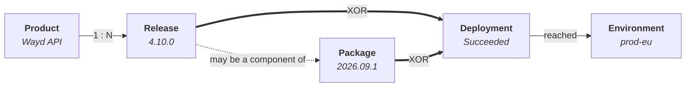

# Delivery

Where the [catalog](./products.mdx) records what exists, delivery records what shipped. Four record types carry it, and the separation between them is what makes the delivery metrics meaningful.

## How the Four Fit Together

A **product** is the thing that exists. A **release** is a version of it. A **package** bundles
releases that ship together. A **deployment** is one of those reaching one environment.

The part that takes a moment to settle is the last step: a deployment attaches to **either** a release
or a package, never both.



The two bold edges are the pair that catches people out. Exactly one of them applies to any given
deployment.

| Record | Holds | Does not hold |
| --- | --- | --- |
| Product | Name, type, place in the catalog tree | Any knowledge of releases |
| Release | Product, version, target / cut / released dates | Where it went; which package carried it |
| Release package | Its own version, a manifest of component versions | A product of its own |
| Deployment | Release *xor* package, environment, frozen category, artifact, outcome | Anything about what changed inside |

:::tip A worked example
Wayd ships two assemblies together and a tool on its own cadence:

```text
Wayd                                Product
├── Wayd API      release 4.10.0    Service
├── Wayd Client   release 2026.05   Application
└── @wayd/mcp     release 1.2.0     Tool

Package 2026.09.1                   released 05 Apr
├── Wayd API      4.10.0            Changed
├── Wayd Client   2026.05           Changed
└── @wayd/mcp     1.1.0             Carried Forward

Deployments
├── Package 2026.09.1  → prod-eu    one deployment, not two
└── Release 1.2.0      → registry   shipped on its own a week later
```

**Two deployments, not four.** The API and Client shipped inside the package, so the package is the
unit. `@wayd/mcp` shipped separately, so its release is the unit. Note that `1.1.0` appears in the
manifest as carried forward — it did not change, but it was in the box.
:::

## Releases

A **release** is a versioned cut of one releasable product node.

A release describes **what was cut, never where it went**. That separation is deliberate: a release with no deployment is a complete record, which is what makes it possible to start recording releases by hand before any pipeline is wired up.

Versions are free text, because version schemes vary and imposing one would make hand-entry wrong for somebody. Wayd never parses or compares them — `4.8.2` and `2026.04` are both just labels, so releases are never sorted by version.

Releases are listed with everything not yet shipped first, then those that have shipped, newest first. What is still coming is what you are usually looking for.

| Status | Meaning |
| --- | --- |
| Planned | Scheduled but not yet cut |
| Ready | Cut and ready to ship |
| Released | Shipped |
| Withdrawn | Pulled after being cut |

A release can only be cut against a node whose [type is releasable](./products.mdx#product-types).

### Recording a Release

**Add Release** creates the record. Cut Date and Released Date are optional on that form, and what
you supply decides where the release starts:

- Leave both empty for something still being planned. It starts at Planned, and you cut and release
  it later as it happens.
- Give a cut date only, for something cut but not yet shipped. It starts at Ready.
- Give both, for something that already shipped. It starts at Released.

Whichever you supply, Wayd applies the same steps in the same order it would have if you had recorded
each one as it happened, so the release ends at the right status with the history to match.

This matters because releases are frequently entered after the fact — during an initial backfill, or
whenever somebody records last month's shipments in one sitting. Those releases are not a different
kind of record, only ones whose steps were entered at once.

A release can be marked released without ever having been cut. Cutting is not a prerequisite, and
demanding one would make importing historical releases impossible.

### Cutting, Releasing and Withdrawing

Each action records something that happened, and each is one-way:

- **Cut** freezes scope and moves the release to Ready. A release cannot be cut twice.
- **Mark Released** records the ship date and moves it to Released. The released date cannot be
  earlier than the cut date.
- **Withdraw** pulls a release. A released release can still be withdrawn — pulling something after
  it shipped is exactly the case this exists for — but a withdrawn one cannot be released.

Actions that a release would refuse are not offered, so the menu shows only what that release will
actually accept.

### Release Status History

Every status change is recorded, so a release's route stays visible after the fact — when it was
cut, how long it sat in Ready before shipping, who moved it.

Open it from the release detail page, either by clicking the **status tag** in the header or by
choosing the **Status History** section. Each entry shows the statuses moved **from** and **to** (the
first entry has no "from" — it records the release entering its initial state), **when** the change
happened, **who** made it, and a **reason** where one was given, as on a withdrawal.

Each entry reports the status names **as they were at the time**, so renaming a status does not
rewrite what past entries read as.

The history is append-only, and records only status changes. Correcting a date leaves it untouched,
which is the point of having a separate action for it.

Changes made by an importer or a background process show as **System**. A change whose author is no
longer linked to an employee record shows as **Unknown**.

Viewing history needs only view access to the release.

### Correcting Dates

**Correct Dates** fixes a target, cut or released date that was recorded wrongly. It changes only the
dates: the release keeps its current status, and its status history is left as it is.

This is deliberately separate from Cut and Mark Released. Those assert that the release moved, and
refuse to run twice — so without a correction action the only way to fix a released date would be to
withdraw the release and release it again, recording two status changes that never happened.

All three dates are offered whether or not the release has one, because a **missing** date is as
likely to be the error as a wrong one. A release can be marked released without ever being cut, so
the cut date is commonly filled in afterwards. The target and cut dates can equally be cleared: each
only records something that was written down.

Two rules survive, and both are real:

- **The released date cannot be before the cut date.** A release cannot ship before it was cut.
- **The released date cannot be cleared.** Emptying it would leave a released record contradicting its
  own status. If the release did not in fact ship, [revert it](#reverting-a-release) instead — that
  moves the status to match.

A withdrawn release cannot have its dates corrected.

### Reverting a Release

**Revert Release** is for a release marked as shipped **by mistake** — the wrong record was updated,
and it never actually went out. It returns the release to Ready, or to the workflow's initial status
where it was never cut, and clears the released date. A reason is required.

This is not the same act as withdrawing, and the distinction matters:

| | Withdraw | Revert |
| --- | --- | --- |
| What happened | The release shipped and was then pulled | The release never shipped; the record was wrong |
| Resulting status | Withdrawn — terminal | Ready, or the initial status — still live |
| Released date | Kept: it did ship | Cleared: it did not |
| Reason | Optional | Required |

Recording a mistake as a withdrawal would leave the history asserting that somebody pulled a release
nobody ever shipped — and the history is append-only, so a later reader has no way to tell.

A reverted release can be released again properly once the facts are right.

## Release Packages

A **release package** is several component releases shipped as one coordinated unit — the weekly pipeline run that deploys fifteen services together. The package is versioned in its own right and carries a manifest of every component version it shipped.

**Where a package exists, it is the unit of deployment** and its component releases are not. One pipeline run shipping fifteen services must count as one deployment, not fifteen — otherwise deployment frequency measures how finely you have subdivided your services rather than how often you ship.

:::warning A package is not a Release Train
A release package is not a Release Train. A Release Train is SAFe's organizational construct — a long-lived group of teams — and Wayd models that as a [Team of Teams](../organizations/index.mdx#teams). A package is one shipment.
:::

### Assembling a Package

**Assemble Package** creates the package and its manifest together. A package ships at least one
component, so the manifest is authored up front rather than added afterwards.

Each manifest line records a component, the version that shipped, and whether that version
**Changed** in this package or was **Carried Forward** unchanged. Recording the carried-forward
lines is what lets a reader reconstruct exactly what was in the box, rather than only what moved.

A line may name the release the version came from, but does not have to. A carried-forward component
often names a version that was never cut as a release in Wayd at all, so the version is held as text
in its own right.

**A component may appear only once in a manifest.** Products already named by another line are not
offered again.

### Editing a Manifest

**Edit Manifest** replaces the manifest as a whole. Components are not individually addressable — they
carry no identifier of their own — so the form submits every line the package should end up with, and
a line removed from it is removed from the package.

The manifest closes once the package is released or withdrawn, and the action stops being offered:

- A **released** package's manifest is a matter of record. What was in the box cannot be rewritten
  after the box shipped.
- A **withdrawn** package is kept because deployments may reference it, not so that it can be edited.

### Releasing and Withdrawing a Package

- **Mark Released** records the ship date and closes the manifest. A package with an empty manifest
  cannot be released.
- **Withdraw** pulls the package, with an optional reason recorded on the status transition. As with
  releases, a released package can still be withdrawn, and a withdrawn one cannot be released.

The package itself is never deleted. Deployments point at it, and erasing it would take the record of
what reached an environment along with it.

Every status change is recorded, and the **Status History** section reads the same way as a
[release's](#release-status-history).

### Finding the Packages a Release Shipped In

A release carries no pointer back to the package it shipped inside. Membership is recorded by the
package's manifest and read from there, so filtering packages by component answers "what did this
ship in?" without a second copy of the relationship that could disagree with the first.

## Environments

An **environment** is a named target a release is deployed into. Environments are defined once for the organization, and any product can deploy into any of them.

Each environment carries a **category**: Development, Testing, Staging, or Production. The category, not the name, is what every production-scoped measure counts on — pipeline environment names are free text and endlessly varied (`prod`, `Production`, `prd`, `live`, somebody's `prod-canary`), so the category is what makes "deployments to production" answerable.

Environments are also ordered into **rings**, so progressive rollout is representable.

:::note Reclassifying does not rewrite history
Each deployment freezes the category of the environment it went into, so reclassifying an environment changes where *future* deployments count and leaves past ones as they were. A staging environment promoted to production does not retroactively inflate your deployment frequency. Wayd records the reclassification as its own event rather than an ordinary edit, so the change in what gets counted from then on is traceable.
:::

Environments are managed under **Settings → Delivery → Environments**.

### Retiring an Environment

Environments are **retired rather than deleted**, because historical deployments still point at them.
There is no delete action, and deliberately so: removing an environment would take with it the record
of everything that ever reached it.

**Retire** takes an environment out of use. It is no longer offered as a deployment target, but the
environment and every deployment recorded against it are kept, and those deployments keep counting
toward the measures they already count toward. The confirmation shows how many deployments reference
the environment first, so the consequence is visible before the action is taken.

A retired environment can be **Reinstated** at any time, which puts it back in the picker.

Editing and reclassifying are offered only on an active environment — the domain refuses both on a
retired one — so a retired row offers Reinstate and nothing else.

## Deployments

A **deployment** is one release or package reaching one environment, with a start, an end, an outcome, and its own artifact identifier. It is the substrate every delivery metric is computed from.

| Status | Meaning |
| --- | --- |
| In Progress | Under way, with no outcome yet |
| Succeeded | Reached its environment |
| Failed | Did not reach its environment |
| Rolled Back | Reached its environment and was reverted |

### Starting a Deployment

**Start Deployment** records a deployment beginning. A deployment carries **either a release or a
package, never both and never neither**, so the form offers one toggle and one picker rather than two
optional pickers — the invalid combinations cannot be expressed. Where a package exists it is the
unit of deployment, for the reason given [above](#release-packages).

Only **active** environments are offered, because an inactive one is refused.

The **artifact** is the build that actually shipped — `4.8.2.008` where the release version is
`4.8.2`. It is free text and never parsed. Two builds of one release are two deployments.

Leaving **Started At** empty records the deployment as starting now, which is what a pipeline
reporting in real time would do.

### Recording an Outcome

A deployment that has started is only ever completed. There is **no edit and no delete** — a
deployment records something that happened, and no such endpoint exists.

- **Record Success** and **Record Failure** are offered only while the deployment is still in flight.
  Once an outcome is recorded, neither is offered again.
- **Roll Back** is offered only on a **succeeded** deployment. A failed deployment never reached its
  environment, so there is nothing to revert.

A completion cannot predate the start, and a rollback cannot predate the completion.

:::note What a rolled-back deployment counts as
A rollback still counts toward **deployment frequency** — it reached production, which is what that
measures — and counts against **change failure rate**. The two measures deliberately disagree about
it, which is the point of having both.
:::

### The Frozen Environment Category

A deployment's **Category** is the environment's category *as it stood when the deployment ran*, not
the environment's category today. A row can therefore legitimately show a different category from the
environment it names — see [Reclassifying does not rewrite history](#environments) above.

## Delivery Metrics

Two of the four [DORA](https://dora.dev/) measures are computable from what this module records. The other two are reported as explicitly unavailable rather than omitted or approximated, so you can tell "we do not measure this yet" from "there were no deployments."

### Deployment Frequency

How often production deployments completed over the window.

This counts **completed** deployments, not attempts: an in-flight deployment has not been delivered, and a failed one did not reach production. Rolled-back deployments **do** count — they reached production, which is what this measures. Whether that was a good idea is change failure rate's job.

### Change Failure Rate

The share of production deployments that failed or were rolled back.

Only production counts. A failure caught in staging is a failure that was *prevented*, and counting it would invert what the measure means.

:::caution This is a proxy, not the industry measure
DORA's change failure rate counts changes that **degraded service** — which a deployment record cannot know. What Wayd counts is deployments recorded as failed or rolled back, which is the closest signal available without an incident feed. The two diverge in both directions: a rollback made as a precaution counts here and should not, and a bad change nobody rolled back does not count here and should. Read it as a trend in remediated deployments rather than as the DORA number, and the screen labels it that way.
:::

### Lead Time for Changes — not yet available

Needs a link from a deployment back to the change it carried, such as a commit or a work item.

### Time to Restore Service — not yet available

Needs an incident record: when service degraded and when it recovered. A rollback is not a substitute, because it says a change was reverted rather than that service was restored.

:::tip Combining windows
Every metric carries its counts and totals alongside the average, so you can combine windows or scopes without average-of-averages bias.
:::

## Questions This Usually Raises

### If a release shipped inside a package, does it have its own deployment?

No. The package was deployed; the release rode along. A release's **Deployments** section shows only
deployments recorded against it directly, so for a release that shipped inside a package it is empty —
and its **Packages** section is where the trail continues.

This is the most common source of "why is this empty?", and it follows directly from
[the package owning the deployment](#release-packages).

### How does the release page know which packages carried it?

By asking the packages, not by storing a pointer. A release holds **no field** naming the package it
shipped in — membership lives in the manifest and is read from that side, because a second copy of the
relationship could disagree with the first.

The **Packages** section on a release runs that query for you, matching packages whose manifest names
that exact release. A manifest line that names a version never cut as a release here carries no
release id, so it correctly does not match.

### Can a release be in more than one package?

Yes. A hotfix bundle and a monthly roll-up can both contain the same component version. What is
constrained is the other direction: a component may appear **only once** within a single manifest.

### Do I have to create a package?

No. Packages are for coordinated shipments. A product that ships on its own cadence just has releases
and deployments, and that is a complete record. Reach for a package when several things genuinely go
out as one unit and you would otherwise record that one ship several times.

### Where do capabilities like PPM or Planning fit?

Not in this chain. Nothing here has a version of its own, and the delivery model is built around
versions. Capabilities are a separate axis that spans artifacts — PPM is implemented by both the API
and the client, so it cannot be a child of either. That axis is designed but not yet built.

### Why can I not delete any of this?

Nothing in delivery is deletable. A release or package is **withdrawn**, an environment is
**retired**, and a deployment is never removed at all — it is a historical fact, and the measures read
that history. Removing an environment would take the record of everything that ever reached it with
it.

## Permissions

Each record type is granted separately, so someone can be allowed to record deployments without also
being able to cut releases.

| Record | Permission | Actions |
| --- | --- | --- |
| Releases | `Permissions.Releases.*` | View, Create, Update |
| Release packages | `Permissions.ReleasePackages.*` | View, Create, Update |
| Deployments | `Permissions.Deployments.*` | View, Create, Update |
| Environments | `Permissions.DeploymentEnvironments.*` | View, Create, Update |
| Delivery metrics | `Permissions.DeliveryMetrics.*` | View |

**No record in delivery carries a Delete permission**, because nothing here is deletable. A release
and a package are withdrawn, an environment is retired, and a deployment is a historical fact that is
never removed at all — each keeps the record and its status history rather than erasing it. The
terminal actions are all `Update`.
| Delivery metrics | `Permissions.DeliveryMetrics.View` | View |

Recording a release or deployment outcome — cutting, releasing, withdrawing, correcting dates, or
marking a deployment succeeded, failed or rolled back — additionally requires your account to be
linked to an employee record, because the change is attributed to the person who made it.
