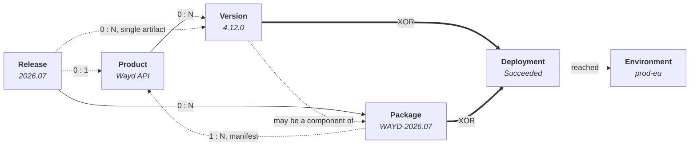

# Delivery

Where the [catalog](./products.mdx) records what exists, delivery records what shipped. Five record types carry it, and the separation between them is what makes the delivery metrics meaningful.

## How the Five Fit Together

The word "release" means three different things in most organizations, and Wayd keeps them apart:

- What did we **announce to customers**? That is a **release** — `Wayd 2026.07`.
- What **moved through environments together**? That is a **release package** — `WAYD-2026.07`.
- What **version of this one artifact**? That is a **version** — `Wayd API 4.12.0`.

Plus a **deployment**, which records one of those reaching one environment.

It reads as one sentence with no word doing double duty: *Release 2026.07 shipped package
WAYD-2026.07, containing Wayd API version 4.12.0, deployed to Production.*



The two bold edges are the pair that catches people out. Exactly one of them applies to any given
deployment.

A package points at **products** as well as versions because each manifest line names the component
product, and the version record only where one exists — a carried-forward component was often never
cut in Wayd, so the version survives as text alone. That is also why a package can never be empty:
its manifest is what it is.

| Record | Holds | Does not hold |
| --- | --- | --- |
| Product | Name, type, place in the catalog tree | Any knowledge of versions |
| Release | Its own label, target / released dates, product notes, the versions and packages it announced | A cut date — it is never cut |
| Version | Product, version number, target / cut / released dates, engineering notes | Where it went; which package carried it |
| Release package | Its own version, and a manifest naming a product and version per component | A product of its own; an owning release |
| Deployment | Version *xor* package, environment, frozen category, artifact, outcome | Anything about what changed inside |

:::tip Which one am I looking at?
If a customer would recognise the name, it is a **release**. If it names one artifact and a version
number, it is a **version**. If it is what the pipeline pushed, it is a **package**.
:::

:::tip A worked example
Wayd ships two assemblies together and a tool on its own cadence, and announces the lot as one
release:

```text
Wayd                                Product
├── Wayd API      version 4.10.0    Service
├── Wayd Client   version 2026.05   Application
└── @wayd/mcp     version 1.2.0     Tool

Release 2026.09                     announced 12 Apr
├── Package 2026.09.1               released 05 Apr
└── @wayd/mcp 1.2.0                 carried directly

Package 2026.09.1                   released 05 Apr
├── Wayd API      4.10.0            Changed
├── Wayd Client   2026.05           Changed
└── @wayd/mcp     1.1.0             Carried Forward

Deployments
├── Package 2026.09.1  → prod-eu    one deployment, not two
└── Version 1.2.0      → registry   shipped on its own a week later
```

**Two deployments, not four.** The API and Client shipped inside the package, so the package is the
unit. `@wayd/mcp 1.2.0` shipped separately, so its version is the unit. Note that `1.1.0` appears in
the manifest as carried forward — it did not change, but it was in the box.

**One release, announced later.** `2026.09` gathers both, and is announced on the 12th even though
the package went out on the 5th: shipping and announcing are separate acts. `@wayd/mcp 1.2.0` is
carried **directly** rather than through a package of its own, because nobody assembled one.
:::

## Versions

A **version** is a versioned cut of one releasable product node — `Wayd API 4.12.0`. It is what was *built*, as distinct from a [release](#releases), which is what was *announced*.

A version describes **what was cut, never where it went**. That separation is deliberate: a version with no deployment is a complete record, which is what makes it possible to start recording versions by hand before any pipeline is wired up.

Version numbers are free text, because version schemes vary and imposing one would make hand-entry wrong for somebody. Wayd never parses or compares them — `4.8.2` and `2026.04` are both just labels, so versions are never sorted by number.

Versions are listed with everything not yet shipped first, then those that have shipped, newest first. What is still coming is what you are usually looking for. "Not yet shipped" means no released date, so a withdrawn version that never shipped sorts into that first group alongside planned ones.

| Status | Meaning |
| --- | --- |
| Planned | Scheduled but not yet cut |
| Ready | Cut and ready to ship |
| Released | Shipped |
| Withdrawn | Pulled after being cut |

A version can only be cut against a node whose [type is releasable](./products.mdx#product-types). That gate is about the artifact: a [release](#releases) may be announced under any node, including a product line, which is usually not releasable.

### Recording a Version

**Add Version** creates the record. Cut Date and Released Date are optional on that form, and what
you supply decides where the version starts:

- Leave both empty for something still being planned. It starts at Planned, and you cut and release
  it later as it happens.
- Give a cut date only, for something cut but not yet shipped. It starts at Ready.
- Give both, for something that already shipped. It starts at Released.

Whichever you supply, Wayd applies the same steps in the same order it would have if you had recorded
each one as it happened, so the version ends at the right status with the history to match.

This matters because versions are frequently entered after the fact — during an initial backfill, or
whenever somebody records last month's shipments in one sitting. Those versions are not a different
kind of record, only ones whose steps were entered at once.

A version can be marked released without ever having been cut. Cutting is not a prerequisite, and
demanding one would make importing historical versions impossible.

### Cutting, Releasing and Withdrawing

Each action records something that happened, and each is one-way:

- **Cut** freezes scope and moves the version to Ready. A version cannot be cut twice.
- **Mark Released** records the ship date and moves it to Released. The released date cannot be
  earlier than the cut date.
- **Withdraw** pulls a version. A released version can still be withdrawn — pulling something after
  it shipped is exactly the case this exists for — but a withdrawn one cannot be released.

Actions that a version would refuse are not offered, so the menu shows only what that version will
actually accept.

### Version Status History

Every status change is recorded, so a version's route stays visible after the fact — when it was
cut, how long it sat in Ready before shipping, who moved it.

Open it from the version detail page, either by clicking the **status tag** in the header or by
choosing the **Status History** section. Each entry shows the statuses moved **from** and **to** (the
first entry has no "from" — it records the version entering its initial state), **when** the change
happened, **who** made it, and a **reason** where one was given, as on a withdrawal.

Each entry reports the status names **as they were at the time**, so renaming a status does not
rewrite what past entries read as.

The history is append-only, and records only status changes. Correcting a date leaves it untouched,
which is the point of having a separate action for it.

A change made by a [bulk import](./bulk-import.mdx) names the account that ran the import, and the
version's Activity labels the actor **Import** — the import did this, rather than that person having
recorded each version by hand. A change whose author is no longer linked to an employee record shows
as **Unknown**. Nothing in delivery is attributed to **System**: that label is reserved for the platform
acting on its own behalf, and no version, package or deployment action is made that way.

Viewing history needs only view access to the version.

### Correcting Dates

**Correct Dates** fixes a target, cut or released date that was recorded wrongly. It changes only the
dates: the version keeps its current status, and its status history is left as it is.

This is deliberately separate from Cut and Mark Released. Those assert that the version moved, and
refuse to run twice — so without a correction action the only way to fix a released date would be to
withdraw the version and release it again, recording two status changes that never happened.

All three dates are offered whether or not the version has one, because a **missing** date is as
likely to be the error as a wrong one. A version can be marked released without ever being cut, so
the cut date is commonly filled in afterwards. The target and cut dates can equally be cleared: each
only records something that was written down.

Two rules survive, and both are real:

- **The released date cannot be before the cut date.** A version cannot ship before it was cut.
- **The released date cannot be cleared.** Emptying it would leave a released record contradicting its
  own status. If the version did not in fact ship, [revert it](#reverting-a-version) instead — that
  moves the status to match.

A withdrawn version cannot have its dates corrected.

### Reverting a Version

**Revert Version** is for a version marked as shipped **by mistake** — the wrong record was updated,
and it never actually went out. It returns the version to Ready, or to the workflow's initial status
where it was never cut, and clears the released date. A reason is required.

This is not the same act as withdrawing, and the distinction matters:

| | Withdraw | Revert |
| --- | --- | --- |
| What happened | The version shipped and was then pulled | The version never shipped; the record was wrong |
| Resulting status | Withdrawn — terminal | Ready, or the initial status — still live |
| Released date | Kept: it did ship | Cleared: it did not |
| Reason | Optional | Required |

Recording a mistake as a withdrawal would leave the history asserting that somebody pulled a version
nobody ever shipped — and the history is append-only, so a later reader has no way to tell.

A reverted version can be released again properly once the facts are right.

## Releases

A **release** is what was **announced to customers** — `Wayd 2026.07`. It gathers whatever versions
and packages carried it, and it is the record a product manager works with rather than an engineer.

A release has its **own version label**, separate from the version numbers of the artifacts inside
it. `2026.07` belongs to the announcement; `4.12.0` belongs to the API. Both are free text and
neither is ever parsed.

| Status | Meaning |
| --- | --- |
| Planned | Drafted but not yet announced |
| Ready | Ready to announce |
| Released | Announced to customers |
| Withdrawn | Retracted after being announced |

A release is **never cut**. Cutting freezes an artifact's scope and belongs to a version; a release's
scope is simply whichever versions and packages it carries.

### Scoping a Release to a Product

A release **may** name a product, and usually names a product line rather than a leaf. `Wayd 2026.07`
announces work across the API, the client and the MCP server, so pinning it to one of them would be
misleading.

Leave it empty for a release that spans product lines. Note that a release with no product is
deliberately **excluded** when you filter releases by product — it belongs to no single product, so
listing it under one would misstate what that product announced.

Unlike a version, a release is **not** restricted to releasable product types. That gate asks whether
an artifact can be cut against a node, which is a different question.

### Setting What a Release Contains

Contents are attached after the release is created, because an announcement is commonly drafted
before anyone knows which versions will make it. An **empty release is legitimate** and is not a
draft — a repackaging or a pricing change is announced with nothing deployed.

There are two routes in, and a release may use both:

- **Packages** — the usual route. The package is the deployment unit, so most contents arrive this way.
- **Versions carried directly** — for a single artifact that shipped on its own, where nobody
  assembled a package. Rather than invent a package of one, the release names the version.

**Edit Contents** sets both routes together, as one **whole-set replacement**: the form submits
everything the release should end up with, so a version or package left out is removed from it, and
submitting nothing at all clears the release.

Both routes are edited in one form rather than two because the rule below spans them. Set separately,
each half would have to be judged against a release only half-changed — and moving a version into the
package that carries it would work in one order and be refused in the other.

:::warning A version is announced once, by one route
A version shipping inside one of the release's packages **cannot also be carried directly**.
Otherwise `2026.07` would announce the same shipment twice and "what did it contain" would have two
different answers.

The rule is applied to what the release ends up containing, so a version **can** be moved from being
carried directly into a package that ships it — that is one change of mind, not a double count. A
package line that names no version record covers nothing, so it never conflicts.
:::

Contents are frozen once the release is announced or withdrawn, for the same reason a package's
manifest is: what was announced is then a matter of record.

### Announcing, Retracting and Reverting

- **Mark Released** records the announcement date. It is **refused while anything the release carries
  has not shipped** — telling customers `2026.07` is out while a version inside it has not gone
  anywhere is the one claim a release can make that its own contents contradict.
- **Withdraw** retracts a release after it was announced. It says **nothing about the versions it
  carried**: an artifact that shipped has shipped whatever the market was later told, so each version
  is withdrawn separately where it too was pulled.
- **Revert** is for a release marked as announced **by mistake**, exactly as
  [for a version](#reverting-a-version). It clears the released date and requires a reason.

**Correct Dates** fixes a target or released date recorded wrongly, without moving the status. There
is no cut date to correct.

Status history works exactly as it does [for a version](#version-status-history).

## Release Packages

A **release package** is several component versions shipped as one coordinated unit — the weekly pipeline run that deploys fifteen services together. The package is versioned in its own right and carries a manifest of every component version it shipped.

**Where a package exists, it is the unit of deployment** and its component versions are not. One pipeline run shipping fifteen services must count as one deployment, not fifteen — otherwise deployment frequency measures how finely you have subdivided your services rather than how often you ship.

:::warning A package is not a Release Train
A release package is not a Release Train. A Release Train is SAFe's organizational construct — a long-lived group of teams — and Wayd models that as a [Team of Teams](../organizations/index.mdx#teams). A package is one shipment.
:::

### Assembling a Package

**Assemble Package** creates the package and its manifest together. A package ships at least one
component, so the manifest is authored up front rather than added afterwards.

Each manifest line records a component, the version that shipped, and whether that version
**Changed** in this package or was **Carried Forward** unchanged. Recording the carried-forward
lines is what lets a reader reconstruct exactly what was in the box, rather than only what moved.

A line may name the version record it came from, but does not have to. A carried-forward component
often names a version that was never cut in Wayd at all, so the version string is held as text
in its own right.

**A component may appear only once in a manifest.** Products already named by another line are not
offered again.

### Editing a Manifest

**Edit Manifest** replaces the manifest as a whole. Components are not individually addressable — they
carry no identifier of their own — so the form submits every line the package should end up with, and
a line removed from it is removed from the package.

The manifest closes once the package is released or withdrawn, and the action stops being offered:

- A **released** package's manifest is a matter of record. What was in the box cannot be rewritten
  after the box shipped.
- A **withdrawn** package is kept because deployments may reference it, not so that it can be edited.

### Releasing and Withdrawing a Package

- **Mark Released** records the ship date and closes the manifest. A package with an empty manifest
  cannot be released.
- **Withdraw** pulls the package, with an optional reason recorded on the status transition. As with
  versions, a released package can still be withdrawn, and a withdrawn one cannot be released.

Withdrawing keeps the package. **Delete** (with `Permissions.Delivery.Delete`) removes it with its
manifest, its status history and every deployment of it. It is refused while any release lists the
package: remove it from the release's contents first, or — for a released or withdrawn release, whose
contents are fixed — delete the release. The versions it names are kept. It is for a package assembled by mistake, or for purging history.

Every status change is recorded, and the **Status History** section reads the same way as a
[version's](#version-status-history).

### Finding the Packages a Version Shipped In

A version carries no pointer back to the package it shipped inside. Membership is recorded by the
package's manifest and read from there, so filtering packages by component answers "what did this
ship in?" without a second copy of the relationship that could disagree with the first.

## Environments

An **environment** is a named target a release is deployed into. Environments are defined once for the organization, and any product can deploy into any of them.

Each environment carries a **category**: Development, Testing, Staging, Production, or Other. The category, not the name, is what every production-scoped measure counts on — pipeline environment names are free text and endlessly varied (`prod`, `Production`, `prd`, `live`, somebody's `prod-canary`), so the category is what makes "deployments to production" answerable.

**Other** is for a target that fits none of the stages — a sandbox, a demo box, a training environment. It counts toward no delivery measure. Reach for it rather than filing such an environment under Development or Production, both of which are wrong in a way nothing will tell you about: one hides it, the other inflates every production-scoped figure.

Environments are also ordered into **rings**, so progressive rollout is representable.

:::note Reclassifying does not rewrite history
Each deployment freezes the category of the environment it went into, so reclassifying an environment changes where *future* deployments count and leaves past ones as they were. A staging environment promoted to production does not retroactively inflate your deployment frequency. The category is changed on the ordinary Edit form, but Wayd records the change as an event of its own rather than folding it into the edit, so the change in what gets counted from then on stays traceable.
:::

Environments are managed under **Product Management → Environments**, alongside the rest of delivery
rather than in Settings. An environment is a record, not a setting: it has an activity trail, a
deployment count, and a retire-and-reinstate lifecycle, and every deployment points at one. Creating,
editing and retiring are still gated on the environment permissions. They can also be loaded from a
file — see [Bulk Import](./bulk-import.mdx#environments-import) — which is the quick way to define
every environment a historical set of deployments ever reached.

### Retiring or Deleting an Environment

Retire an environment rather than delete it, because historical deployments still point at it.
Deleting takes with it the record of everything that ever reached it.

**Retire** takes an environment out of use. It is no longer offered as a deployment target, but the
environment and every deployment recorded against it are kept, and those deployments keep counting
toward the measures they already count toward. Where any deployment references the environment, the
retire confirmation says how many, so the consequence is visible before the action is taken.

A retired environment can be **Reinstated** at any time, which puts it back in the picker.

Editing and reclassifying are offered only on an active environment — the domain refuses both on a
retired one — so a retired row offers only Reinstate, and Delete if you hold it.

**Delete** (with `Permissions.DeploymentEnvironments.Delete`) removes the environment **and every
deployment into it**, with their status history, and the delivery measures and rollout stop counting
them. The confirmation says how many deployments will go. Where there are any, it also needs
`Permissions.Delivery.Delete`, because it deletes deployments. It is for an environment defined by
mistake, or for purging history outright.

## Deployments

A **deployment** is one version or package reaching one environment, with a start, an end, an outcome, and its own artifact identifier. It is the substrate every delivery metric is computed from.

| Status | Meaning |
| --- | --- |
| In Progress | Under way, with no outcome yet |
| Succeeded | Reached its environment |
| Failed | Did not reach its environment |
| Rolled Back | Reached its environment and was reverted |

### Starting a Deployment

**Start Deployment** records a deployment beginning. A deployment carries **either a version or a
package, never both and never neither**, so the form offers one toggle and one picker rather than two
optional pickers — the invalid combinations cannot be expressed. Where a package exists it is the
unit of deployment, for the reason given [above](#release-packages).

Only **active** environments are offered, because an inactive one is refused.

The **artifact** is the build that actually shipped — `4.8.2.008` where the version number is
`4.8.2`. It is free text and never parsed. Two builds of one version are two deployments.

Leaving **Started At** empty records the deployment as starting now, which is what a pipeline
reporting in real time would do.

Deployments recorded elsewhere — a pipeline's history, a spreadsheet — can be loaded in bulk with their
real timestamps and outcomes; see [Bulk Import](./bulk-import.mdx#deployments-import).

### Recording an Outcome

A deployment that has started is only ever completed. There is **no edit** — a deployment records
something that happened. **Delete** (with `Permissions.Delivery.Delete`) is for one recorded by
mistake; see [Can I delete any of this?](#can-i-delete-any-of-this).

- **Record Success** and **Record Failure** are offered only while the deployment is still in flight.
  Once an outcome is recorded, neither is offered again.
- **Roll Back** is offered only on a **succeeded** deployment. A failed deployment never reached its
  environment, so there is nothing to revert.

A completion cannot predate the start, and a rollback cannot predate the completion.

:::note What a rolled-back deployment counts as
A rollback still counts toward **deployment frequency** — it reached production, which is what that
measures — and counts against **change failure rate**. The two measures deliberately disagree about
it, which is the point of having both.
:::

### The Frozen Environment Category

A deployment's **Category** is the environment's category *as it stood when the deployment ran*, not
the environment's category today. A row can therefore legitimately show a different category from the
environment it names — see [Reclassifying does not rewrite history](#environments) above.

## Rollout

**Rollout** answers what is running in each environment right now. It is derived from the deployment record rather than stored, so it can never drift out of step with it — there is nothing to keep in sync and nothing to correct.

Each entry is the latest deployment that **succeeded and stayed succeeded**, which is not the same as the latest deployment. A failed attempt never reached the environment, so the version before it is still what is there. A rollback replaces its own deployment's status, so the version before *it* wins again. Both cases are the point of having this page separately from Deployments: the newest row there tells you what happened last, and this tells you what is live.

Where a later attempt on the same product failed or was rolled back, the entry is marked. The running version is still the honest answer, but on its own it would hide that someone has since tried to move past it and could not.

:::note A package is expanded, not listed
A package deployment is broken into its [manifest](#release-packages) and each component competes for its own product's slot, so every row on this page is a product. Listing the package itself instead would report **every bundle ever deployed** as running: successive bundles carry the same components, and no bundle supersedes a differently-numbered one.

An entry that arrived inside a package names it, so the deployment the version rode in on stays visible.
:::

Retired environments are left out by default. They still hold the history of everything that ever reached them, but nothing is running there. **Show retired** brings them back, tagged, so an empty card is not read as a gap.

## Delivery Overview

**Delivery** measures version activity over a window — what was **cut and shipped**, rather than what reached an environment. It is the overview for the records below it, and it is deliberately answerable without any deployment records at all.

Scope is a product node, defaulting to all products. Selecting a node covers **that node and everything beneath it**, so picking a grouping rolls up its children rather than reporting nothing — a product line has no versions of its own. The picker leaves out any branch with nothing releasable beneath it, since scoping to one could only ever report zero.

| Measure | What it counts |
| --- | --- |
| Versions released | Versions marked released in the window, as a weekly rate |
| Cut to released | Mean days from cutting a version to releasing it |

**Neither counts release packages.** A package is a bundle of versions, not a version, and counting one would count the same shipment twice — its components are each released in their own right.

Each tile carries its counts beside the rate, so two windows are combined by summing the parts rather than averaging the rates; an average of averages weights a quiet week the same as a busy one. Each also compares against the window immediately before. Where nothing shipped then, the tile says there is nothing to compare against rather than showing a rise from zero, which would invent a trend out of a product's first fortnight.

### Version Activity

A day-by-day grid of versions released per product, drawn as the catalog tree and indented by depth. Every node appears exactly once — a node that is both releasable and a parent would otherwise be listed twice, as a row and again as a heading over its own children.

A grouping is shown so the hierarchy reads, but it has **no day cells at all**: it can never have versions cut against it, and an empty row would claim it had a quiet fortnight rather than that the question does not apply to it. A grouping with nothing releasable anywhere beneath it is left out entirely.

Products that shipped nothing are kept. A missing row reads as "not in scope" rather than "nothing shipped", and the quiet product is usually the one worth noticing.

Shading is an **absolute** scale — none, one, two, three, four, and five or more — not one relative to the busiest day on screen. A relative scale silently redefines every shade when the window changes, so the same cell means "a quiet day" in one window and "the busiest day" in another, and two screenshots cannot be compared. The legend names what each shade stands for.

### Recent Delivery Activity

What has happened to versions **and packages** lately, most recent first: released, cut and awaiting release, withdrawn. A package entry says how many components it carried and links to its manifest rather than listing them.

Read from [status history](#version-status-history) rather than the records' own dates, for two reasons. The dates are dates — they carry no time of day, so two things that happened on one afternoon could not be ordered. And a date says the state a record is in now, while a transition says the moment it changed, which is what a feed is a list of.

:::note Packages drop out when you scope to a product
A package spans several products, so attributing one to a single node would put the same shipment under each of them. Scoping the page to a product therefore leaves packages out of the feed, and the entries you see are versions alone.
:::

:::caution Cut to released excludes what it cannot measure
A version can be marked released without ever having been cut, and [that is deliberate](#recording-a-version) — demanding a cut first would make importing historical versions impossible. Those versions carry no latency, so they are left out rather than counted as zero, which would make the average improve every time more history was loaded. The tile says how many of the window's releases it actually speaks for.
:::

:::note What this page does not say
Neither measure says anything about whether a deployment worked. A version has no failed state — its lifecycle is Planned, Ready, Released and Withdrawn — and failure belongs to the [deployment](#deployments), where it is scoped to production. Measuring it from version records would be inventing an answer. See [Delivery Metrics](#delivery-metrics) for what the deployment record supports.
:::

## Activity

Versions, releases, packages and deployments each carry an **Activity** section holding the record's
full history: what changed, who changed it, and when. Where a record also has a Status History
section, the two differ in scope — status history covers transitions alone, while activity covers
every change the record raised an event for, including edits, date corrections and manifest changes.
See [Activity Log](../activity-log.mdx).

Environments have no detail page, so their changes are recorded but not browsable this way.

## Delivery Metrics

Two of the four [DORA](https://dora.dev/) measures are computable from what this module records. The other two are reported as explicitly unavailable rather than omitted or approximated, so you can tell "we do not measure this yet" from "there were no deployments."

### Deployment Frequency

How often production deployments completed over the window.

This counts **completed** deployments, not attempts: an in-flight deployment has not been delivered, and a failed one did not reach production. Rolled-back deployments **do** count — they reached production, which is what this measures. Whether that was a good idea is change failure rate's job.

### Change Failure Rate

The share of production deployments that failed or were rolled back.

Only production counts. A failure caught in staging is a failure that was *prevented*, and counting it would invert what the measure means.

:::caution This is a proxy, not the industry measure
DORA's change failure rate counts changes that **degraded service** — which a deployment record cannot know. What Wayd counts is deployments recorded as failed or rolled back, which is the closest signal available without an incident feed. The two diverge in both directions: a rollback made as a precaution counts here and should not, and a bad change nobody rolled back does not count here and should. Read it as a trend in remediated deployments rather than as the DORA number, and the screen labels it that way.
:::

### Scoping Metrics to a Product

Filtering the measures to one product counts **only its version deployments**. A package spans
several products, so attributing one package deployment to any single product would count the same
shipment once under each of them.

That is the right answer for the total, but it means a product that ships exclusively inside packages
shows no deployments at all when the measures are scoped to it. Read the unscoped figures for an
organization that delivers mainly through packages.

### Lead Time for Changes — not yet available

Needs a link from a deployment back to the change it carried, such as a commit or a work item.

### Time to Restore Service — not yet available

Needs an incident record: when service degraded and when it recovered. A rollback is not a substitute, because it says a change was reverted rather than that service was restored.

:::tip Combining windows
Every metric carries its raw counts alongside the derived figure — deployment frequency reports the
count and the number of days, change failure rate the failed and total counts. Combine windows or
scopes by summing those rather than by averaging the rates, which would weight a quiet week the same
as a busy one.
:::

## Questions This Usually Raises

### What is the difference between a release and a version?

A **version** is what was built — one artifact, one version number, `Wayd API 4.12.0`. A **release**
is what was announced — `Wayd 2026.07` — and it gathers whatever versions and packages carried it.

Most organizations use the word "release" for both, which is exactly the confusion the split exists
to remove. If a customer would recognise the name, it is a release.

### If a version shipped inside a package, does it have its own deployment?

No. The package was deployed; the version rode along. A version's **Deployments** section shows only
deployments recorded against it directly, so for a version that shipped inside a package it is empty —
and its **Packages** section is where the trail continues.

This is the most common source of "why is this empty?", and it follows directly from
[the package owning the deployment](#release-packages).

### How does the version page know which packages carried it?

By asking the packages, not by storing a pointer. A version holds **no field** naming the package it
shipped in — membership lives in the manifest and is read from that side, because a second copy of the
relationship could disagree with the first.

The **Packages** section on a version runs that query for you, matching packages whose manifest names
that exact version record. A manifest line that names a version string never cut here carries no
version id, so it correctly does not match.

### Can a version be in more than one package?

Yes. A hotfix bundle and a monthly roll-up can both contain the same component version. What is
constrained is the other direction: a component may appear **only once** within a single manifest.

The same is true of packages and releases: one package may be announced by more than one release.

### Do I have to create a package?

No, and this is true at both levels. Packages are for coordinated shipments: a product that ships on
its own cadence just has versions and deployments, and that is a complete record.

A **release** likewise does not need one. A single artifact announced on its own is carried
[directly by the release](#setting-what-a-release-contains), rather than wrapping it in a package of
one that nobody actually assembled.

### Do I have to create a release?

No. Versions, packages and deployments are a complete engineering record on their own. Add releases
when you want to record what was announced to customers as distinct from what was built — which is
usually when the two stop lining up one-to-one.

### Where do capabilities like PPM or Planning fit?

Not in this chain. Nothing here has a version of its own, and the delivery model is built around
versions. Capabilities are a separate axis that spans artifacts — PPM is implemented by both the API
and the client, so it cannot be a child of either. That axis is designed but not yet built.

### Can I delete any of this?

Withdrawing and retiring are the everyday way out: a version, release or package is **withdrawn**, and
an environment is **retired**, so the record and its history stay and the measures can still read them.

A **deployment** can be deleted, with `Permissions.Delivery.Delete`, for one recorded by mistake or to
purge a retired product's history. It takes its status history with it and the delivery measures stop
counting it, so a deployment that really failed or was rolled back should be recorded as such rather
than deleted.

A **version** can be deleted, with `Permissions.Delivery.Delete`, once no release lists it and no
package manifest names it, and takes every deployment of it with it.

A **package** can be deleted, with `Permissions.Delivery.Delete`, once no release lists it, and takes
every deployment of it with it.

A **release** can be deleted, with `Permissions.Releases.Delete`, in any state. Its list of contents and
its status history go with it; the versions and packages it listed are kept. Deleting an announced
release is also how a package it lists becomes deletable, since an announced release's contents are
fixed.

An **environment** can be deleted, with `Permissions.DeploymentEnvironments.Delete` (and
`Permissions.Delivery.Delete` if any deployment went into it), and takes every deployment into it with it — see [Retiring or Deleting an Environment](#retiring-or-deleting-an-environment).

The activity history and audit trail are kept when a record is deleted, including the entry recording
the delete.

## Permissions

The engineering records — versions, release packages and deployments — share a single **Delivery**
permission. They are one causal story rather than three features: a version is cut, it goes into a
package, the package deploys. Someone who could see deployments but not packages would see that
something reached production with no way to learn what was in it.

Releases are granted separately, because the audience is genuinely different: a product manager
drafting an announcement is not the person recording that the pipeline ran.

| Record | Permission | Actions |
| --- | --- | --- |
| Versions, release packages, deployments | `Permissions.Delivery.*` | View, Create, Update, Delete, [Import](./bulk-import.mdx#versions-import) |
| Releases | `Permissions.Releases.*` | View, Create, Update, Delete, [Import](./bulk-import.mdx#releases-import) |
| Environments | `Permissions.DeploymentEnvironments.*` | View, Create, Update, Delete, [Import](./bulk-import.mdx#environments-import) |
| Delivery metrics | `Permissions.DeliveryMetrics.*` | View |

**Delete is its own grant**, separate from `Update`, because it erases the record and its status
history. The terminal actions — withdrawing, retiring, recording an outcome — are all `Update` and keep
both. Every delivery record can be deleted.

Some actions **additionally require your account to be linked to an employee record**, because the
change is attributed to the person who made it. The permission alone is not enough, and the refusal
is a separate one.

- **Versions** — cut, mark released, revert, withdraw, correct dates. Planning a version, editing its
  details and moving its target date do not require the link.
- **Releases** — every action except planning one: editing details, moving the target date and
  setting contents all require it, as well as announcing, reverting, withdrawing and correcting dates.
- **Packages** — mark released and withdraw. Assembling a package and editing its manifest do not
  require the link.
- **Deployments** — recording an outcome: succeeded, failed or rolled back. **Starting** a deployment
  does not, so a pipeline reporting in can open a deployment without a linked account.
- **Environments** — no action requires the link.

Releases are stricter than versions here, and deliberately so: an announcement is a statement to
customers, so every edit to one names who made it.
