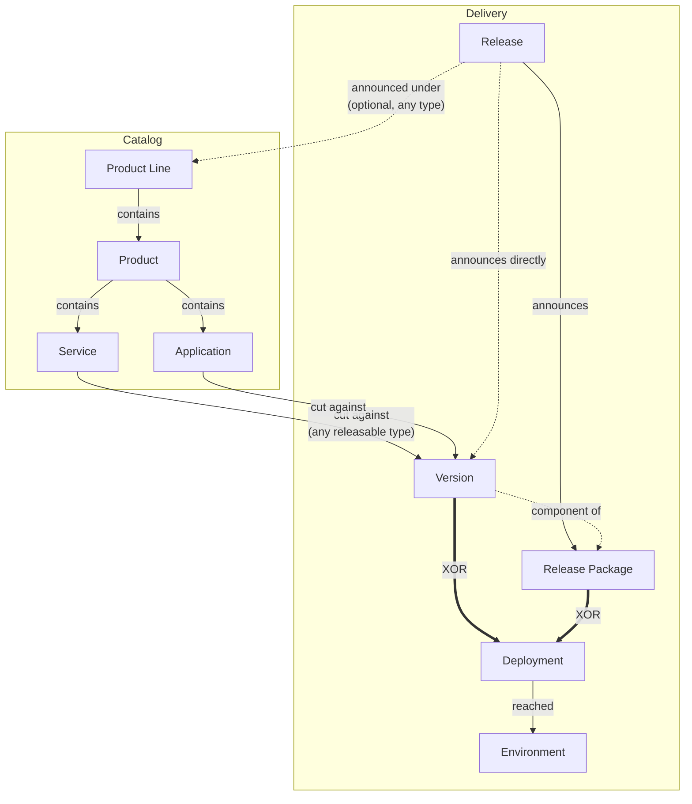

# Product Management

Product Management is the record of **what your organization builds** and **what has shipped**. Where [PPM](../ppm/index.mdx) tracks the funded effort to change something and [Work Management](../work-management/index.mdx) tracks the items being worked, Product Management holds the durable catalog those efforts act on — the product lines, applications and services that exist whether or not a project is currently touching them — and the versions, releases and deployments that carry changes into an environment.

:::note Feature flag
Product Management is gated by the **Product Management** feature flag, which is disabled when first deployed. An administrator enables it under [Settings → Feature Flags](../settings/index.mdx). While it is off the area is not reachable at all.
:::

## Two Different Hierarchies

The most common point of confusion is that a product sits in two structures at once, and they answer different questions.

**The product tree** is composition: a Product Line contains Products, which contain Services and Applications. This is what the catalog shows, and it is the hierarchy you move a product within.

**The delivery relationship**: a version is cut against one releasable node, several component versions may ship together inside a package, and a release announces whatever carried it to customers.

A node's **type** decides whether versions can be cut against it — a Product Line is usually an organizing container, while a Service is a thing that ships. A release, being an announcement rather than an artifact, may sit under any node.

A deployment carries **either** a version or a package, never both — see
[how the five fit together](./delivery.mdx#how-the-five-fit-together).

## How Product Management Connects Across Wayd

- **[Strategic Themes](../strategic-management/index.mdx#strategic-themes)** and products both answer "why are we building this?" from different ends — themes give the intent, the catalog gives the thing.
- **[Projects](../ppm/projects.mdx)** are the funded effort to change a product. A project is temporary; the product outlives it.
- **Tags** carry the classifications that do not change behaviour — platform, tech stack, compliance scope — so the type system can stay small.
- **External links** point a product at the repository, pipeline or registry package that owns it, so a later automated feed can be matched against hand-curated products rather than re-authored.

## What Is Available Today

Every area of Product Management now has both a screen and an API.

| Area | Interface | API |
| --- | --- | --- |
| Products, types, tags | Yes | Yes |
| Releases and versions | Yes | Yes |
| Release packages | Yes | Yes |
| Deployments and environments | Yes | Yes |
| Delivery metrics | Yes | Yes |

Delivery metrics reports the two measures this module can compute from what it records. The other two are shown as unavailable, each with the reason, rather than approximated — see [Delivery Metrics](./delivery.mdx#delivery-metrics).

## Sections

- **[Products](./products.mdx)** — The catalog: creating products, the tree, types, statuses, tags, moving, and external links
- **[Delivery](./delivery.mdx)** — Releases, versions, packages, deployments, environments, and the delivery metrics computed from them

## Permissions

Every action in this area is granted by permission claim alone; unlike PPM, there is no membership or leadership requirement on a record. Permissions are assigned to roles under [Settings → Roles](../settings/index.mdx).

| Permission | Grants |
| --- | --- |
| `Permissions.Products.View` | See the catalog and product details |
| `Permissions.Products.Create` | Add products |
| `Permissions.Products.Update` | Edit, retype, move, tag, change status, link externally |
| `Permissions.Products.Delete` | Remove products |
| `Permissions.ProductTypes.*` | Manage the type list |
| `Permissions.ProductTagCategories.*` | Manage the tag axes and the tags on them |
| `Permissions.Delivery.*` | Manage versions, packages and deployments |
| `Permissions.Releases.*` | Manage product releases (announcements) |
| `Permissions.DeploymentEnvironments.*` | Manage deployment environments |
| `Permissions.DeliveryMetrics.View` | See the delivery measures |
