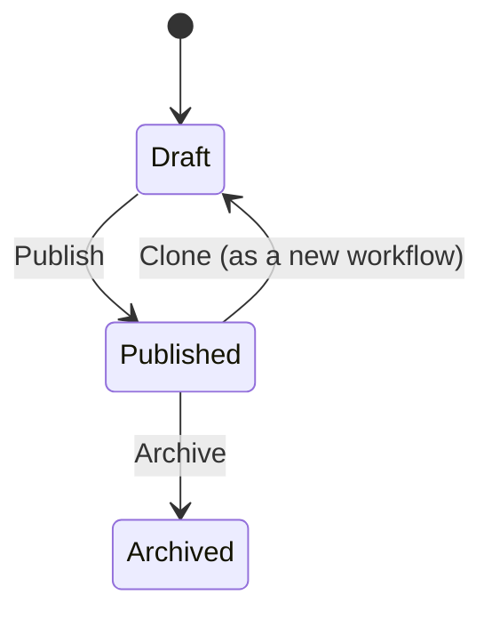

# Status Workflows

A **status workflow** is the set of statuses one kind of record moves through — the stages a product passes from Concept to Retired, or a deployment from In Progress to Succeeded. Wayd ships a default workflow for each kind, and this is where you change them.

Workflows are managed under **Settings → Status Workflows** and require the `Permissions.StatusWorkflows.*` permissions.

:::note Status is data, meaning is code
Renaming a status changes what people read; it does not change what Wayd does. The behaviour is carried by a status's **category** and its **alias**, which are described below. That separation is what lets you call a status whatever your organization calls it without breaking the reports built on it.
:::

## What a workflow is made of

### Record types

Every workflow governs exactly one **record type**, chosen when the workflow is created and fixed thereafter. Today those are Product, Release, Release Package and Deployment.

The record type also decides the vocabulary available to the workflow's statuses — a Release has a meaning for "Released" that a Product does not.

### Statuses

A **status** is one stage. Each has:

- **Name** — what people see. Yours to choose.
- **Description** — what it means, shown when picking a status.
- **Category** — the rollup it belongs to. One of Proposed, Active, Done or Removed.
- **Alias** — an optional well-known meaning, drawn from the record type's vocabulary.
- **Order** — the display position.

### Categories

The **category** is how a status rolls up when something counts records rather than listing them. A board grouping by category puts every Active status in one column whatever each is called.

| Category | Means |
| --- | --- |
| Proposed | Not yet in play |
| Active | In play |
| Done | Finished successfully |
| Removed | Finished without succeeding |

### Aliases

An **alias** marks the one status that carries a specific meaning for that record type. Wayd's own logic looks for the alias, never the name — so a deployment's change failure rate counts whichever status is aliased **Failed**, whether you call it Failed, Errored or Did Not Ship.

Each record type declares aliases it cannot function without, and a workflow missing one cannot be published:

| Record type | Required aliases |
| --- | --- |
| Product | Active, Retired |
| Release | Released, Withdrawn |
| Release Package | Released, Withdrawn |
| Deployment | In Progress, Succeeded, Failed, Rolled Back |

An alias can be held by only one status in a workflow — two statuses both meaning Released would make "is it released?" unanswerable.

## The lifecycle of a workflow

A workflow is **Draft**, **Published** or **Archived**.

**Draft** is the only state in which statuses can be added, renamed, reclassified, removed or reordered. Nothing uses a draft yet, so restructuring it is free.

**Published** means records can be assigned to it — and it is **immutable**. Statuses cannot be added or removed, and none can change category or alias.

:::note Why published workflows are frozen
Every record carries a copy of its status's category and alias. Changing a published status would leave every record holding it disagreeing with the status it points at — a product would report as Active while the status said Done. Moving records is a [reassignment](#changing-which-workflow-is-used), not an edit.
:::

**Archived** retires a workflow. A workflow that a record type is still assigned to cannot be archived — reassign that record type first.

### Platform workflows

The workflows Wayd seeds are marked **System**. They cannot be edited, published or archived, so an upgrade always finds them as it left them. To diverge from one, clone it.

## Changing a published workflow

You cannot. You clone it, change the copy, publish that, and reassign.

1. Choose **Clone** from the workflow's row, or from its detail page. The copy carries every status and arrives as a Draft.
2. Edit the draft — add, rename, reclassify, remove, reorder.
3. **Publish** it. Wayd refuses if a required alias is missing, and names the ones it needs.
4. **Reassign** the record type to it, which is where existing records move across.

This is the same shape Jira and Azure DevOps use, and for the same reason: the workflow in use has records depending on it, so changes are staged on a copy rather than applied underneath them.

## Changing which workflow is used

A record type can have several workflows — the one in use, a draft being prepared, and any it has retired — so the list's **Assigned** column marks the one actually governing records. **Change workflow**, on that row's actions menu, moves the record type to another workflow and brings every existing record with it.

This is the only operation in Wayd that rewrites every record of a type at once, so it runs in three reviewed steps.

### 1. Choose a target

Only published workflows for the same record type are offered, excluding the one in use.

### 2. Review the mapping

Every status in the current workflow must be given a destination in the new one. Wayd maps what it can and shows how each row was decided:

| Matched by | Means | Trust |
| --- | --- | --- |
| **Alias** | Both statuses carry the same well-known meaning | Unambiguous |
| **Name** | Both are spelled the same | Reliable |
| **Category** | The target has exactly one status in that category | A guess — check it |
| **Unresolved** | Nothing could be chosen | You must decide |
| **Chosen** | You overrode the automatic choice | Yours |

Each row shows how many records currently hold that status, so you can see what is actually at stake. Unresolved rows sort to the top, and you cannot continue until every row has a destination.

Any automatic choice can be overridden — a Category match in particular deserves a look, since it was picked only because there was one candidate.

### 3. Confirm

The final step states how many records will move, and from which workflow to which. Every moved record gains an entry in its status history, so the change is traceable afterwards.

:::warning Reassignment is not undone automatically
Moving back is another reassignment. The records will carry both moves in their history.
:::

## Common tasks

### Creating a workflow

1. Navigate to **Settings → Status Workflows**
2. Click **Create Workflow**
3. Enter a **Name**, choose a **Record Type**, and optionally a **Description**
4. Add statuses, then **Publish**

### Adding a status to a draft

1. Open the workflow
2. Click **Add Status**
3. Enter a **Name**, choose a **Category**, and optionally an **Alias** and **Description**

Aliases already held by another status are not offered.

### Fixing a workflow that will not publish

The publish dialog names the required aliases the workflow is missing. Edit the status that should carry one and set its **Alias** — there is no need to delete and recreate it.

### Retiring a workflow

Reassign every record type using it to another workflow, then **Archive** it. Archiving is refused while anything still points at it.

## Permissions

| Action | Permission |
| --- | --- |
| View workflows and their statuses | `Permissions.StatusWorkflows.View` |
| Create a workflow, or clone one | `Permissions.StatusWorkflows.Create` |
| Edit a draft, publish, and reassign a record type | `Permissions.StatusWorkflows.Update` |
| Archive a workflow | `Permissions.StatusWorkflows.Delete` |
